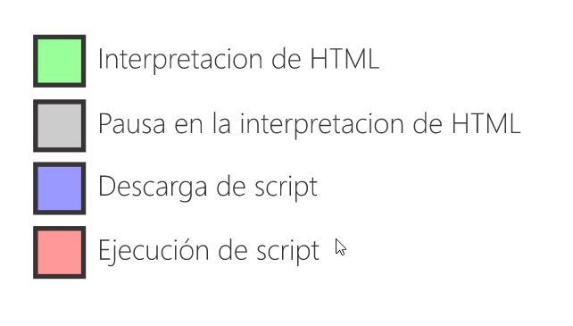
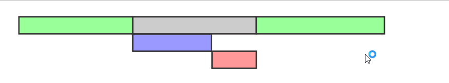
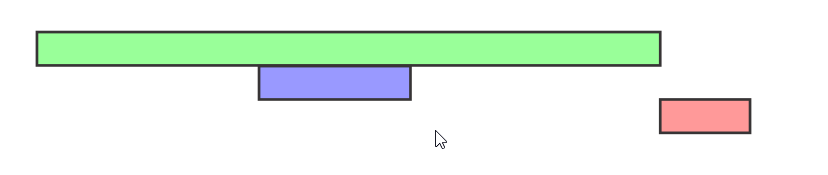

<h1 align="center">Script</h1>

<h2>📑 Contenido</h2>

- [Etiqueta script](#etiqueta-script)
- [Incrustado](#incrustado)
- [Archivo externo](#archivo-externo)
  - [Carga asíncrona](#carga-asíncrona)
  - [Carga diferida](#carga-diferida)
- [¿Cuál es el mejor lugar para color las etiquetas script?](#cuál-es-el-mejor-lugar-para-color-las-etiquetas-script)
  - [Etiqueta script sin ningún atributo](#etiqueta-script-sin-ningún-atributo)
  - [Async](#async)
  - [Defer](#defer)
- [¿Cómo decidir entre usar async o defer?](#cómo-decidir-entre-usar-async-o-defer)

## Etiqueta script

La etiqueta `<script>` se utiliza para incrustar o vincular código JavaScript en una página web.

## Incrustado

Puedes incluir el código JavaScript directamente dentro de la etiqueta` <script>` en el documento HTML.

```html
<!-- HTML -->
<script>
  function saludar() {
    alert("¡Hola, mundo!");
  }
</script>
```

## Archivo externo

También puedes vincular un archivo de JavaScript externo a través de la etiqueta `<script>`. Esto es útil cuando tienes un código JavaScript más grande o deseas reutilizar el código en varias páginas.

```html
<!-- HTML -->
<script src="script.js"></script>
```

### Carga asíncrona

Puedes agregar el atributo `async` para cargar y ejecutar el script de forma asíncrona, lo que significa que **no bloqueará la carga de la página**. Esto es útil para scripts que no son críticos para el contenido principal de la página.

```html
<!-- HTML -->
<script src="script.js" async></script>
```

### Carga diferida

Si deseas retrasar la ejecución del script hasta que la página se haya cargado completamente, puedes usar el atributo defer. Esto es útil cuando el script necesita acceder al contenido de la página.

```html
<!-- HTML -->
<script src="script.js" defer></script>
```

## ¿Cuál es el mejor lugar para color las etiquetas script?

**Debes evitar poner los scripts en el header sin ningún atributo.**

El renderizado e interpretación del HTML se realiza a medida que el navegador encuentra los elementos en tu documento HTML. Por lo tanto si encuentra en la cabecera una etiqueta script, pues tendrá que esperar a que el navegador cargue el script para continuar con el renderizado de la pagina por lo que verías el navegador con la pantalla en blanco, comportamiento que uno desea evitar.

> [!NOTE]
>
> El comportamiento de los scripts se ven afectados por el uso de los atributos async y defer.

**Imagen para los siguientes ejemplos**



### Etiqueta script sin ningún atributo

Cuando definimos una etiqueta script sin ningún atributo el HTML será interpretado hasta que encuentre la etiqueta script, en ese punto la interpretación se detendrá y solicitará el archivo js(en caso sea externo), una vez que tengamos cargado el archivo entonces este sera ejecutado antes de que se continué interpretando el HTML.



### Async

El atributo `async` permite que el navegador descargue el archivo script asíncronamente y continuar con la interpretación del HTML, a penas termine con la descarga interrumpirá la interpretación para empezar la ejecución del script e inmediatamente después continuará con el proceso de interpretación.


### Defer

El atributo `defer` a diferencia de `async`, aplaza(defer) la ejecución del script después de que la interpretación del HTML ha concluido, la descarga se realiza de forma asíncrona igual que en el caso anterior pero defer nos garantiza ejecutar los scripts en el orden en el que aparecen en nuestro documento, a diferencia de `async` que los ejecuta a penas termina de descargar.



## ¿Cómo decidir entre usar async o defer?

Si tienes un script que no depende del contenido de la página y no necesita esperar a que la página se cargue, `async` es una buena opción para una carga más rápida.

Si tienes un script que necesita acceder al contenido de la página o debe ejecutarse después de que la página se cargue completamente, `defer` es una elección más adecuada para garantizar un orden de ejecución predecible y evitar conflictos.

En muchos casos, se recomienda el uso de `defer` para scripts que interactúan con el contenido de la página, ya que garantiza que el código JavaScript no se ejecute hasta que la página esté lista, lo que puede ayudar a prevenir errores y problemas de rendimiento. Sin embargo, es importante evaluar las necesidades específicas de tu sitio web y de los scripts que estás utilizando para tomar la decisión correcta.
