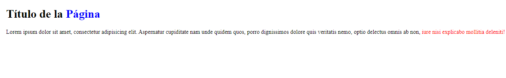
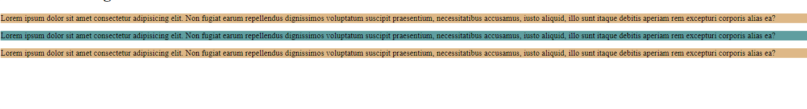
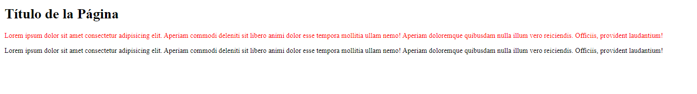
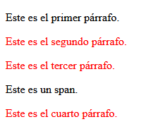

<h1 align="center">Selectores</h1>

<h2>📑 Contenido</h2>

- [¿Qué son los selectores?](#qué-son-los-selectores)
- [Selector universal](#selector-universal)
- [Selector de tipo](#selector-de-tipo)
- [Selector descendiente](#selector-descendiente)
- [Selector de clase e id](#selector-de-clase-e-id)
- [Selector de atributo](#selector-de-atributo)
- [Selector adyacente](#selector-adyacente)
- [Selector de hermano general](#selector-de-hermano-general)
- [HTML, global(\*) y body](#html-global-y-body)
  - [¿Por qué usar rem en el selector html?](#por-qué-usar-rem-en-el-selector-html)

## ¿Qué son los selectores?

Los selectores CSS son patrones que se utilizan para seleccionar y aplicar estilos a elementos HTML en una página web. Los selectores permiten a los diseñadores y desarrolladores web especificar qué elementos deben ser afectados por las reglas de estilo CSS que definen el aspecto y el diseño de una página.

## Selector universal

El selector universal `*` sirve para seleccionar todos los elementos. Mediante este selector podemos aplicar estilos a todos los elementos de la página.

Ejemplo:

```css
/* Aplicar un tamaño de fuente y un color a todos los elementos */
* {
  font-size: 20px;
  color: green;
}
```

## Selector de tipo

Los selectores de tipo seleccionan todos los elementos que pertenezcan a ese tipo concreto.
Si quieres aplicar estilos a todos los encabezados `<h1>` se puede usar el selector de tipo `h1{Declaraciones}`. En resumen, seleccionar por etiquetas HTML.
Se puede aplicar una misma regla para varios tipos de selectores separándoles con comas. `h1,h2,h3 {propiedad: valor;}`

Ejemplo:

```css
/* Aplicar un tamaño de fuente y un color a todos los elementos del body*/
body {
  font-size: 20px;
  color: green;
}

/* Aplicar bordes a todos los encabezados h1*/
h1 {
  border: 3px solid black;
}
```

## Selector descendiente

Los selectores descendiente seleccionan los elementos que se encuentran dentro de otros elementos. El estilo solo se aplicara a los elementos que se encuentren dentro del elemento padre.
Para seleccionar solo los hijos directos se puede usar el mayor que >(selector hijo) entre los selectores `p > span`.

Ejemplo:

Aplicar un color azul a todos los `<span>` y un color rojo a los que se encuentran dentro de un párrafo.

- **Selector descendiente:** con un espacio en blanco entre selectores.
  - `div p ` selecciona todos los párrafos que están dentro de un div, aunque haya otros elementos entre ellos.
- **Selector hijo:** con un mayor que > entre selectores.
  - `div > p` selecciona solo los párrafos que son hijos directos de un div, sin incluir los que están dentro de otros elementos.

```html
<h1>Título de la <span>Página</span></h1>

<p>
  Lorem ipsum dolor sit amet, consectetur adipisicing elit. Aspernatur
  cupiditate nam unde quidem quos, porro dignissimos dolore quis veritatis nemo,
  optio delectus omnis ab non,
  <span>iure nisi explicabo mollitia deleniti!</span>
</p>
```

```css
span {
  color: blue;
}
p span {
  color: red;
}
```

**Resultado:**



## Selector de clase e id

Los selectores de clase e Id sirven para agrupar e identificar elementos HTML y aplicar un estilo.
No se puede usar el mismo nombre para varios ids.
Se puede usar los selectores descendientes con clases e ids. Para las clases se usa un . delante del nombre y para los id se usa # delante del nombre.

Sintaxis(HTML):<br>
`<h1 class="nombre-de-la-clase">Título de la Página</h1>`

`<h1 id="nombre-del-id">Título de la Página</h1>`

Sintaxis(CSS): <br>
`.nombre-de-la-clase{ propiedad: valor}`

`#nombre-del-id{ propiedad: valor}`

> [!NOTE]
>
> - Las clases se pueden aplicar a varios elementos, el ID no.
> - Los ID tienen mayor especificidad que las clases.
> - Selector de Clase = .
> - Selector de Id = #

Ejemplo:

```html
<!-- HTML -->
<p class="parrafos_secundarios">
  Lorem ipsum dolor sit amet consectetur adipisicing elit. Non fugiat earum
  repellendus dignissimos voluptatum suscipit praesentium, necessitatibus
  accusamus, iusto aliquid, illo sunt itaque debitis aperiam rem excepturi
  corporis alias ea?
</p>

<p id="parrafos_principal">
  Lorem ipsum dolor sit amet consectetur adipisicing elit. Non fugiat earum
  repellendus dignissimos voluptatum suscipit praesentium, necessitatibus
  accusamus, iusto aliquid, illo sunt itaque debitis aperiam rem excepturi
  corporis alias ea?
</p>

<p class="parrafos_secundarios">
  Lorem ipsum dolor sit amet consectetur adipisicing elit. Non fugiat earum
  repellendus dignissimos voluptatum suscipit praesentium, necessitatibus
  accusamus, iusto aliquid, illo sunt itaque debitis aperiam rem excepturi
  corporis alias ea?
</p>
```

```css
/* CSS */
#parrafos_principal {
  background-color: cadetblue; /*Azul*/
}

.parrafos_secundarios {
  background-color: burlywood; /*Marron*/
}
```

**Resultado:**



## Selector de atributo

El selector de atributo permite seleccionar elementos en función de su atributo o el valor del atributo.

Sintaxis:<br>
selector[atributo="valor"]{propiedad: valor}

**Caracteres para ser mas específicos:**

Sintaxis:<br>
selector[atributo**carácter**="valor"]{propiedad: valor}

- (\*) --> Todos los elementos que contengan ese valor.
- (^) --> Todos los elementos que empiezan por ese valor.
- ($) --> Todos los elementos que terminan por ese valor.
- (~) --> Buscar un valor sin importar si esta separado por espacios.
- (i o I) --> Para evitar distinguir valores en mayúsculas o minúsculas. Agregar antes del corchete de cierre.
- (s o S) --> Para distinguir valores en mayúsculas o minúsculas. Agregar antes del corchete de cierre.

Ejemplos:

```html
<!-- Enlaces -->
<a href="informacion.html">Información</a>
<a href="blog.html">Blog</a>
<a href="contactos.php">Contactos</a>
```

```css
/* CSS */

/* Cambiar el color(rojo) a todos los enlaces que tengan el atributo. */
a[href] {
  color: red;
}
/* Cambiar el color(azul) a todos los enlaces que contengan el valor `href="blog.html"`. */
a[href="blog.html"] {
  color: blue;
}
/* Cambiar el color(verde) a todos los enlaces que terminen con .php */
a[href$=".php"] {
  color: green;
}
```

## Selector adyacente

Los selectores adyacentes (+) seleccionan solo los elementos que van precedidos por el primer elemento.

```html
<!-- HTML -->
<h1>Título de la Página</h1>

<p>
  Lorem ipsum dolor sit amet consectetur adipisicing elit. Aperiam commodi
  deleniti sit libero animi dolor esse tempora mollitia ullam nemo! Aperiam
  doloremque quibusdam nulla illum vero reiciendis. Officiis, provident
  laudantium!
</p>

<p>
  Lorem ipsum dolor sit amet consectetur adipisicing elit. Aperiam commodi
  deleniti sit libero animi dolor esse tempora mollitia ullam nemo! Aperiam
  doloremque quibusdam nulla illum vero reiciendis. Officiis, provident
  laudantium!
</p>
```

```css
/* CSS */
h1 + p {
  color: red;
}
```

**Resultado:**



## Selector de hermano general

El selector de hermano general `~` selecciona todos los elementos que son hermanos del primer elemento especificado y vienen después de él en el árbol del documento. Es decir, selecciona todos los elementos que están en el mismo nivel (comparten el mismo padre) y que siguen al elemento indicado.

```html
<div>
  <p class="parrafo1">Este es el primer párrafo.</p>
  <p class="parrafo2">Este es el segundo párrafo.</p>
  <p class="parrafo3">Este es el tercer párrafo.</p>
  <span>Este es un span.</span>
  <p class="parrafo4">Este es el cuarto párrafo.</p>
</div>
```

```css
.parrafo1 ~ p {
  color: red;
}
```

**Resultado:**



> [!TIP]
>
> El selector de hermano general ~ se usa comúnmente junto con elementos de formulario, como los checkboxes (input[type="checkbox"]), para mostrar y ocultar contenido en función del estado del checkbox. Esto se puede lograr sin necesidad de JavaScript, utilizando solo CSS.
>
> ```html
> <input type="checkbox" id="toggle" />
> <label for="toggle">Mostrar/Ocultar contenido</label>
> <div class="contenido">
>   <p>Este es el contenido que se mostrará o se ocultará.</p>
> </div>
> ```
>
> ```css
> .contenido {
>   display: none; /* Ocultar el contenido por defecto */
> }
>
> #toggle:checked ~ .contenido {
>   display: block; /* Mostrar el contenido cuando el checkbox está marcad > */
> }
> ```

## HTML, global(\*) y body

Cuándo usar Global (\*)

- **Restablecer estilos por defecto:** Cuando deseas eliminar los márgenes, el relleno y otros estilos predeterminados del navegador para todos los elementos.
- **Estilos globales:** Cuando necesitas aplicar un estilo a todos los elementos, como el box-sizing o un color de borde común.
- **Selector \*:** Utilízalo para resetear o normalizar estilos en todos los elementos. Es particularmente útil al comienzo de un archivo CSS para asegurarte de que todos los elementos partan de un mismo punto base sin estilos predefinidos.

Cuándo usar HTML

- **Definir la base de los estilos globales:** Cuando necesitas establecer configuraciones globales que afectan a todo el documento, como la base del tamaño de la fuente (para unidades rem) y comportamientos globales como el desplazamiento suave.
- **Configuraciones de viewport:** Para estilos que afectan directamente al elemento raíz del documento HTML.
- **Selector html:** Utilízalo para establecer configuraciones globales como el tamaño de fuente base y el comportamiento de desplazamiento. Afecta al documento en su totalidad y establece la base para estilos relativos.

Cuándo usar Body

- **Estilos del contenido principal:** Cuando deseas aplicar estilos a todo el contenido visible de la página, como la configuración de la familia de fuentes, el color de fondo y los márgenes/paddings generales del documento.
- **Diseño global:** Para establecer estilos que afectan la apariencia y disposición del contenido en el `<body>`
- **Selector body:** Utilízalo para aplicar estilos al contenido principal del documento, como fuentes, colores de fondo y márgenes. Afecta a todos los elementos dentro del `<body>` y define la apariencia general de la página.

### ¿Por qué usar rem en el selector html?

La razón principal para definir las unidades rem en el selector html y no en body o \* tiene que ver con la naturaleza y el propósito específico de las unidades rem (root em).

```css
/* Correcto: Definir tamaño base de rem en html */
html {
  font-size: 16px; /* 1rem = 16px */
}

body {
  font-size: 1rem; /* Heredado, pero 1rem sigue siendo 16px */
}

p {
  font-size: 1.5rem; /* 1.5 * 16px = 24px */
}

/* Incorrecto: Definir tamaño base de rem en body (no afecta rem) */
body {
  font-size: 16px; /* 1rem sigue siendo el tamaño de fuente del html */
}

p {
  font-size: 1.5rem; /* 1.5 * tamaño de fuente del html, no del body */
}
```
