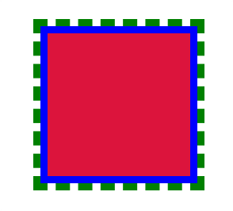
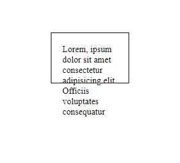
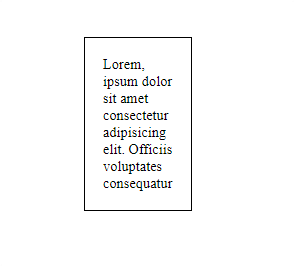
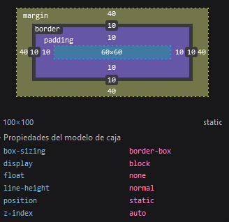

<h1 align="center">Modelo de caja(Box-Model)</h1>

<h2>📑 Contenido</h2>

- [Modelo de cajas](#modelo-de-cajas)
  - [Áreas del modelo de cajas](#áreas-del-modelo-de-cajas)
  - [Border vs outline](#border-vs-outline)
- [Comportamiento de cajas](#comportamiento-de-cajas)
  - [Extrínseco](#extrínseco)
  - [Intrínseco](#intrínseco)
- [Zonas de un elemento](#zonas-de-un-elemento)
  - [Zonas abreviadas](#zonas-abreviadas)
  - [Box-Sizing](#box-sizing)
    - [box-sizing: content-box](#box-sizing-content-box)
    - [box-sizing: border-box](#box-sizing-border-box)
- [Regular la visibilidad de los contenido](#regular-la-visibilidad-de-los-contenido)
  - [Valores de la propiedad overflow](#valores-de-la-propiedad-overflow)
  - [Ejes de la propiedad overflow](#ejes-de-la-propiedad-overflow)
- [Elementos en bloque o en línea](#elementos-en-bloque-o-en-línea)
  - [Valores para display](#valores-para-display)

## Modelo de cajas

El modelo de caja o "box model" hace referencia a las diferentes areas que delimitan el contenido. En los navegadores todo se construye a partir de cajas.
Si a un elemento que tiene ancho y alto de 200px, le aplicamos un padding 20px y un borde 20px el elemento terminara ocupando un ancho de 240px x 240px de alto.

### Áreas del modelo de cajas

- **contenido**: La parte interior de la caja.
- **padding(relleno)**: La parte interior de la caja que separa el contenido del borde.
- **margin(margen)**: Espacio que queda a cada uno de los cuatro lados externos de una caja.
- **border(borde)**: Es el limite que separa el interior(Contenido,Padding) del exterior.
- **outline(contorno)**: Son dibujados por encima del elemento.


---

### Border vs outline

Los outline no ocupan espacio, no suma en el tamaño de la caja y no hay movimiento o desplazamiento de los elementos como con border.

Ejemplo: Aplicando un borde(azul) y un outline(verde)

```html
<!-- HTML -->
<div class="caja"></div>
```

```css
/* CSS */
.caja {
  width: 200px;
  height: 200px;
  background-color: crimson;
  border: 10px solid blue; /* Línea azul uniforme*/
  outline: 10px dashed green; /* Línea verde punteada*/
}
```

Resultado:



## Comportamiento de cajas

Las cajas tienen un comportamiento diferente según su display, sus dimensiones establecidas y el contenido que esta dentro de ellas. Se pueden controlar estos comportamientos mediante el uso de tamaño extrínseco e intrínseco.

### Extrínseco

Son las medidas fijas, cuando añadimos tamaños fijos al ancho o al alto de un elemento.

Ejemplo: tamaño fijo de la caja.

```html
<!-- HTML -->
<p class="extrinseco">
  Lorem, ipsum dolor sit amet consectetur adipisicing elit. Officiis voluptates
  consequatur
</p>
```

```css
/* CSS */
.extrinseco {
  width: 100px;
  height: 50px;
  padding: 20px;
  border: 1px solid;
}
```

Resultado:



### Intrínseco

Son las medidas relativas, cuando el tamaño depende del contenido del elemento.

Ejemplo: adaptar tamaño a la caja con `width:min-content, height:min-content`.

- **width:min-content:** Adaptar el ancho-mínimo de la caja a su contenido.
- **height:min-content:** Adaptar el alto-mínimo de la caja a su contenido.

```html
<!-- HTML -->
<p class="intrinsico">
  Lorem, ipsum dolor sit amet consectetur adipisicing elit. Officiis voluptates
  consequatur.
</p>
```

```css
/* CSS */
.intrinsico {
  width: min-content;
  height: min-content;
  padding: 20px;
  border: 1px solid;
}
```

Resultado:



## Zonas de un elemento

Para poder concretar más a la hora de aplicar ciertas propiedades(margin,padding,border...) se puede hacer referencia a las zonas del elemento.

- **Top:** Parte superior del elemento.
- **Right:** Parte derecha del elemento.
- **Bottom:** Parte inferior del elemento.
- **Left:** Parte izquierda del elemento.
- **Center:** Parte central del elemento.


Ejemplos:

> Aplicar margen solo a la parte superior: `margin-top: valor`
> Aplicar padding solo a la parte izquierda: `padding-left: valor`
> Aplicar borde solo a la parte inferior: `border-bottom: valor`

### Zonas abreviadas

Cuando se usan las propiedades abreviadas o no se concretan la zona, las referencias a estas zonas se aplican empezando por el top y siguiendo las agujas del reloj(top>right>bottom,left). También se puede juntar las zonas en dos grupos top-bottom y right-left.

Ejemplos con la propiedad `margin`.

```css
/* Diferentes maneras de aplicar estilos */
/* -------------------------------------- */
/* Aplicar un margen a todas las zonas de un elemento */
margin: 50px; /*Esto aplica 50px al top-right-bottom-left*/

/* Agrupar top-bottom y right-left */
margin: 100px 50px; /*Esto aplica 100px al top-bottom y 50px right-left*/

/* Aplicar un margen a cada zona de manera abreviada */
margin: 10px 20px 30px 40px;
/*Esto aplica:
  - 10px al top.
  - 20px al right.
  - 30px al bottom.
  - 40px al left.
 */
```

---

### Box-Sizing

Por defecto CSS aplica `box-sizing: content-box` al modelo de caja. Esto significa que no incluye `padding` ni `border` al calcular el ancho-alto del elemento.
Si queremos que el elemento ocupe 200px x 200px incluyendo bordes y padding tenemos que aplicar la propiedad `box-sizing:` con el valor `border-box`.

Esta propiedad se suele aplicar a todos los elementos de manera global: [Snippet de Paul Irish](https://www.paulirish.com/2012/box-sizing-border-box-ftw/)

#### box-sizing: content-box

```css
/* CSS */
div {
  width: 100px;
  height: 100px;
  padding: 10px;
  border: 10px solid;
  margin: 40px;
  box-sizing: content-box; /* Se aplica por defecto*/
}
```


#### box-sizing: border-box

```css
/* CSS */
div {
  width: 100px;
  height: 100px;
  padding: 10px;
  border: 10px solid;
  margin: 40px;
  box-sizing: border-box;
}
```



## Regular la visibilidad de los contenido

Con la propiedad `overflow` podemos regular la visibilidad del contenido que sobre sale de una caja. Si el contenido sobresale(se desborda) de la caja, se mostrara una barra que permita hacer scroll. Se usa para elementos de tipo bloque.

### Valores de la propiedad overflow

- `overflow:hidden` hace que el contenido que sobresale de la caja no sea visible.
- `overflow:visible` hace que el contenido si no entra se salga de la caja
- `overflow:scroll` crea una barra de scroll. Por defecto la barra sera lateral.
- `overflow:auto` depende del agente de usuario. Los navegadores proveen barras de desplazamiento si hay contenido excedente.

> [!TIP]
>
> Recomendable usar el auto para evitar que salgan las barras si no hay desbordamiento.

### Ejes de la propiedad overflow

Se puede controlar el desborde del contenido con las propiedades `overflow-x` y `overflow-y`. En función de por donde desborde el contenido se usara una u otra. Estas propiedades hace uso de los mismos valores que `overflow`. Evita tener que aparezcan las dos barras de scroll cuando solo quieres usar una.

- overflow-x: Para controlar el contenido que se desborda horizontalmente(Eje X)
  - Ten en cuenta que si el texto tiene espacios se acomodara verticalmente.
- overflow-y: Para controlar el contenido que se desborda verticalmente(Eje Y)

Ejemplo: Desbordamiento Horizontal.

```html
<!-- HTML -->
<div>qwertyyyyyyyyyyyyyyyyyyyyyyyyyyyyyyy</div>
```

```css
/* CSS */
div {
  width: 100px;
  height: 100px;
  border: 1px solid;
  overflow-x: scroll;
}
```

Resultado:


## Elementos en bloque o en línea

Si necesitas recordar conceptos sobre los elementos en bloque o en línea.

Con CSS podemos cambiar el comportamiento de los elementos usando la propiedad `display`.
Con la propiedad display también se puede controlar el diseño de flujo `grid` y `flex` pero estos valores tendrán su apartado propio.

### Valores para display

- **block:** Los elementos se comportan como elementos en bloque.
- **inline:** Los elementos se comportan como elementos en linea.
- **inline-block:** Se comportan como elementos en línea, no ocupan espacio horizontal pero mantienen la propiedad block.

> [!NOTE]
>
> Con estos valores podemos hacer que un elemento de tipo en linea tenga acceso a propiedades del tipo bloque.
