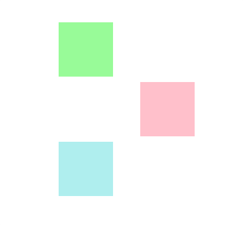
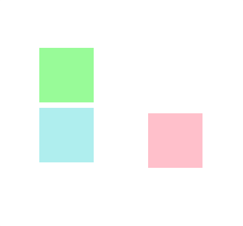
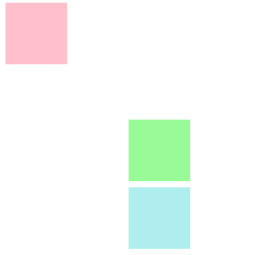

<h1 align="center">Posicionamiento</h1>

<h2>📑 Contenido</h2>

- [Posicionamiento](#posicionamiento)
- [Tipos de posicionamiento](#tipos-de-posicionamiento)
  - [Static](#static)
  - [Relative](#relative)
  - [Absolute](#absolute)
  - [Fixed](#fixed)
  - [Sticky](#sticky)

## Posicionamiento

Con la propiedad `position` podemos especificar como se posiciona o se comporta un elemento HTML en el documento. Para posicionar los elementos es importante recordar las zonas de los elementos.

## Tipos de posicionamiento

- position: **static**
- position: **relative**
- position: **absolute**
- position: **fixed**
- position: **sticky**

### Static

Por defecto los elementos se comportan de forma `static`. Este valor coloca los elementos siguiendo el flujo normal.

> [!IMPORTANT]
>
> Es importante saber que NO se pueden usar las propiedades `top,right ,left y bottom` cuando se utiliza la posición `static`.

### Relative

Al igual que `static` posiciona los elementos siguiendo el flujo normal. La diferencia es que usando el valor `relative` podemos posicionar el elemento mediante `top,right ,left y bottom`.
Los elementos se mueven desde la posición inicial.

Ejemplo: Mover la segunda caja(Rosa) left:150px.

```html
<!-- HTML -->
<div></div>
<div></div>
<div></div>
```

```css
/* CSS */
div:nth-child(1) {
  width: 100px;
  height: 100px;
  background-color: palegreen;
  margin: 10px;
}

div:nth-child(2) {
  width: 100px;
  height: 100px;
  background-color: pink;
  margin: 10px;
  position: relative; /* Aplicar posición relativa*/
  left: 150px;
}

div:nth-child(3) {
  width: 100px;
  height: 100px;
  background-color: paleturquoise;
  margin: 10px;
}
```

Resultado:



> [!NOTE]
>
> El segundo elemento se desplaza a la izquierda pero el tercer elemento se mantiene en su posición.

---

### Absolute

El valor absolute no forma parte del flujo normal. Se posiciona en función de la ventana del navegador o el elemento cercano(excepto elementos `static`). Acepta las propiedades `top,right ,left y bottom`. El resto de elementos ocuparan su posición.

Ejemplo:

```html
<!-- HTML -->
<div></div>
<div></div>
<div></div>
```

```css
/* CSS */
div:nth-child(1) {
  width: 100px;
  height: 100px;
  background-color: palegreen;
  margin: 10px;
}

div:nth-child(2) {
  width: 100px;
  height: 100px;
  background-color: pink;
  margin: 10px;
  position: absolute;
  left: 400px;
}

div:nth-child(3) {
  width: 100px;
  height: 100px;
  background-color: paleturquoise;
  margin: 10px;
}
```

Resultado:



> [!NOTE]
>
> El segundo elemento se desplaza a la izquierda y el tercer elemento ocupa la posición que deja el segundo. Si no se desplazara la caja rosa se sobrepondría en la caja azul.

---

### Fixed

El valor `fixed` al igual que `absolute` no forman parte del flujo normal. Fixed no respeta ningún elemento cercano. Si aplicamos el valor fixed este elemento se mantendrá fijo al hacer scroll. Si aplicamos `fixed` sin mover el elemento este se sobrepondrá, y el elemento más cercano ocupara su posición

Ejemplo:

```html
<!-- HTML -->
<div></div>
<div></div>
<div></div>
```

```css
/* CSS */
div:nth-child(1) {
  width: 100px;
  height: 100px;
  background-color: palegreen;
  margin: 10px;
}

div:nth-child(2) {
  width: 100px;
  height: 100px;
  background-color: pink;
  margin: 10px;
  position: fixed;
  top: 0px;
  left: 0px;
}

div:nth-child(3) {
  width: 100px;
  height: 100px;
  background-color: paleturquoise;
  margin: 10px;
}
```

Resultado:



> [!NOTE]
>
> El segundo elemento se desplaza a la parte superior izquierda. Si hiciéramos scroll se mantendría en esa posición.

---

### Sticky

Los elementos `sticky` se comportan como elementos `relative` hasta que alcanzan cierta posición mediante el uso de scroll. Cuando alcanzan dicha posición pasan a comportarse como un elemento `fixed`

Ejemplo:

```html
<!-- HTML -->
<div></div>
<div></div>
<div></div>
```

```css
/* CSS */
div:nth-child(1) {
  width: 100px;
  height: 100px;
  background-color: palegreen;
  margin: 10px;
}

div:nth-child(2) {
  width: 100px;
  height: 100px;
  background-color: pink;
  margin: 10px;
  position: sticky;
  top: 0;
}

div:nth-child(3) {
  width: 100px;
  height: 100px;
  background-color: paleturquoise;
  margin: 10px;
}
```

Resultado:


> [!NOTE]
>
> Al llegar el scroll al top 0 del elemento sticky, este se fija y mantiene su posición.
