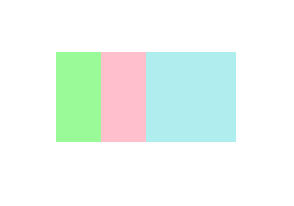
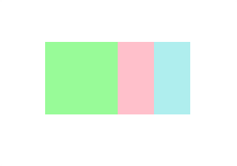
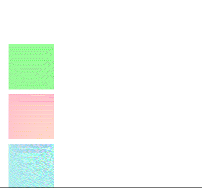
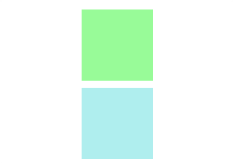
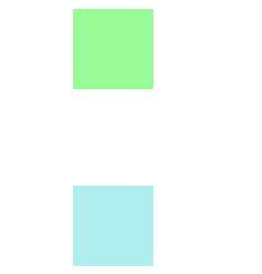

<h1 align="center">Capas (Z-Index) y visibilidad</h1>

<h2>📑 Contenido</h2>

- [El contexto de apilamiento](#el-contexto-de-apilamiento)
- [Capas (z-index)](#capas-z-index)
  - [Ejemplo z-index](#ejemplo-z-index)
- [Visibilidad](#visibilidad)
  - [display](#display)
  - [visibility](#visibility)

## El contexto de apilamiento

El contexto de apilamiento es la conceptualización tridimensional de los elementos HTML a lo largo de un eje-Z imaginario relativo al usuario que se asume está de cara al viewport o página web. Los elementos HTML ocupan este espacio por orden de prioridad basado en sus atributos.

## Capas (z-index)

Cuando varios elementos se superponen, con la propiedad `z-index` podemos controlar que elementos cubren a otros. Los elementos con mayor valor(numero entero) z-index se sobrepondrán sobre los que menos valor. Para poder aplicar esta propiedad es necesario que los elementos tengan una posición sobrepuesta. Las posiciones `static ` no se pueden sobreponer.

Si no se especifica la propiedad `z-index` se sobrepondrán los elementos por cascada, es decir el ultimo que aparezca.

> [!WARNING]
>
> z-index solo tiene efecto si un elemento es [posicionado](./02-Posicionamiento.md).



> Orden en el HTML: 1-Verde, 2-Rosa, 3-Azul.

### Ejemplo z-index

Cambiar orden de los valores del ejemplo anterior.

```html
<!-- HTML -->
<div></div>
<div></div>
<div></div>
```

```css
/* CSS */
div:nth-child(1) {
  width: 100px;
  height: 100px;
  background-color: palegreen;
  position: absolute;
  left: 50px;
  z-index: 3;
}

div:nth-child(2) {
  width: 100px;
  height: 100px;
  background-color: pink;
  position: absolute;
  left: 100px;
  z-index: 2;
}

div:nth-child(3) {
  width: 100px;
  height: 100px;
  background-color: paleturquoise;
  position: absolute;
  left: 150px;
  z-index: 1;
}
```

Resultado:



## Visibilidad

Al ocultar un elemento este puede afectar a la posición que ocupa. Puede que el elemento este oculto pero que su espacio que ocupa siga presente en la página. Las dos maneras más usadas para ocultar los elementos son las propiedades `display` y `visibility`.

Ejemplo sin aplicar valores:



### display

Aplicando el valor none. El Elemento no sera visible ni ocupara espacio en el documento.



### visibility

Aplicando el valor hidden. El elemento no sera visible pero si ocupara espacio en el documento.


