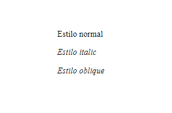
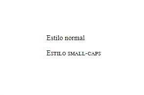
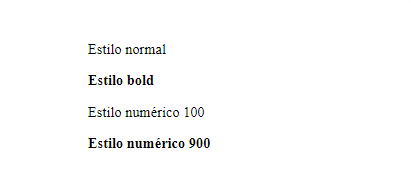
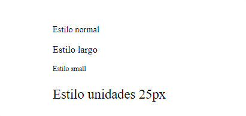
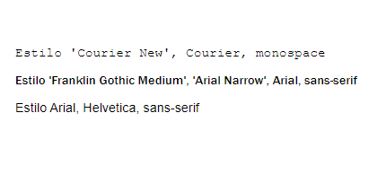

<h1 align="center">Fuentes</h1>

<h2>📑 Contenido</h2>

- [Fuentes](#fuentes)
- [Propiedades](#propiedades)
  - [Propiedad abreviada font](#propiedad-abreviada-font)
  - [font-style](#font-style)
  - [font-variant](#font-variant)
  - [font-weight](#font-weight)
  - [font-size](#font-size)
  - [font-family](#font-family)
- [Importar fuentes](#importar-fuentes)

## Fuentes

Mediante el uso de varias propiedades, podemos modificar la familia de la fuente, el color, el tamaño, el grueso, expandir la fuente...

## Propiedades

### Propiedad abreviada font

Permite establecer `font-style, font-variant, font-weight, font-size, line-height y font-family` de una sola vez.

> Sintaxis: `font: 700 small-caps 1.5em sans-serif`

---

### font-style

Permite establecer el estilo con el que se muestra el tipo de letra.

> Sintaxis: `font-style: valor;`

Valores:

- normal
- italic
- oblique



---

### font-variant

Permite elegir la variante con la que se muestra el tipo de letra seleccionado mediante la propiedad font-family.

> Sintaxis: `font-variant: valor;`

Valores:

- normal
- small-caps



---

### font-weight

Permite especificar el peso o grueso de la letra.

> Sintaxis: `font-weight: valor;`

Valores:

- normal
- bold
- Numéricos:
  - Desde 100 hasta 900
- Relativos al padre:
  - lighter
    -bolder



---

### font-size

Permite especificar la dimensión de la letra.

> Sintaxis: `font-size: valor(unidad);`

Valores:

- normal
- largo
- small
- medium
- uso de unidades(px,%,em...)



---

### font-family

Permite definir una lista de fuentes o familias de fuente.

> Sintaxis: `font-family: valor(fuentes);`

Algunos Valores:

- 'Courier New', Courier, monospace
- 'Franklin Gothic Medium', 'Arial Narrow', Arial, sans-serif
- Arial, Helvetica, sans-serif



## Importar fuentes

Si la lista de fuentes que tiene CSS se te queda corta siempre puedes importar nuevas fuentes para implementar en tu página. Sin importar la procedencia de las fuentes existen bueno más bien conozco dos formas, usando `@import` y `<link>`. Las fuentes las puedes almacenar en local o acceder a ellas en la nube.

Ejemplo usando fuentes de [Google Fonts](https://fonts.google.com/#styles)

**Lia burros:**

- Selecciona la fuente que quieras usar [Roboto].
- Añade los estilos que quieras. Ejemplo thin 100,Light 300, Regular 400...
- En el apartado "Selected family" > "Use on the web" tenemos 2 opciones:
  - `<link>` El link se sitúa en el `head` del documento HTML
  - `@import` El import se sitúa en el documento CSS o dentro de las etiquetas `<style>`

Aplicar la fuente seleccionada con `@import`

```html
<!-- HTML -->
<p>
  Lorem ipsum dolor sit amet, consectetur adipisicing elit. Id magnam labore,
  modi architecto quisquam autem aperiam obcaecati nobis recusandae! Unde labore
  quam harum hic reiciendis cupiditate quibusdam, aliquid beatae sequi!
</p>
```

```css
/* CSS */
@import url("https://fonts.googleapis.com/css2?family=Roboto:ital@1&display=swap");

p {
  font-family: "Roboto", sans-serif;
}
```
