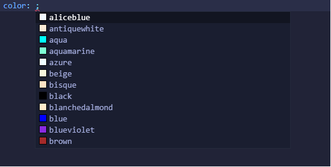
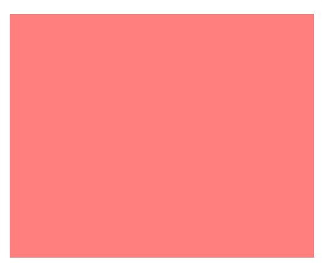
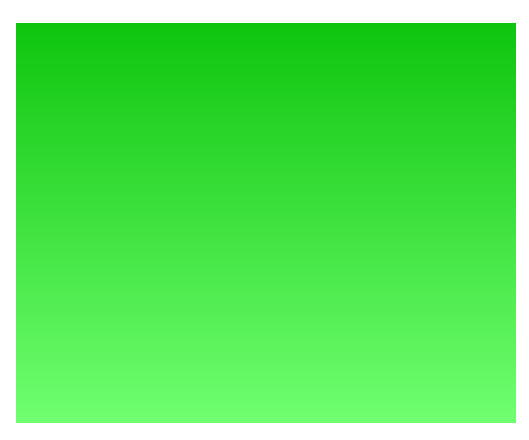
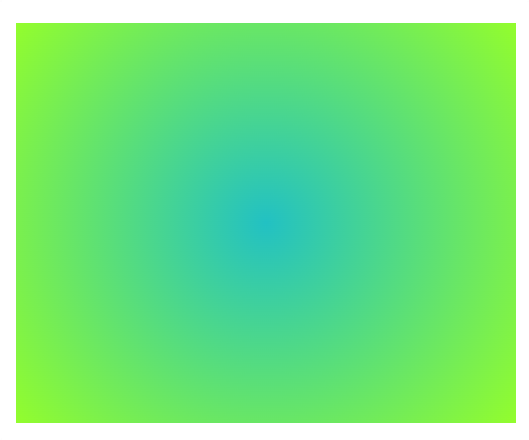
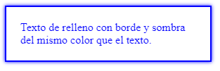

<h1 align="center">Colores</h1>

<h2>📑 Contenido</h2>

- [Colores](#colores)
- [Nombres simples](#nombres-simples)
- [RGBA (rojo, verde, azul)](#rgba-rojo-verde-azul)
- [Hexadecimal](#hexadecimal)
- [HSL (tono, saturación, luminosidad)](#hsl-tono-saturación-luminosidad)
- [Degradado](#degradado)
  - [Degradado lineal (\`linear-gradient)](#degradado-lineal-linear-gradient)
  - [Degradado circular (\`radial-gradient)](#degradado-circular-radial-gradient)
- [Current color](#current-color)

## Colores

En CSS existen varias formas de especificar colores. Nombres simples en inglés, colores hexadecimales, RGBA(Rojo, Verde, Azul), HSL(tono, saturación, luminosidad), gradientes.

## Nombres simples

Son colores que vienen predefinidos con su nombre en inglés, `black, white, red, green...`



## RGBA (rojo, verde, azul)

Los colores RGBA admiten 4 parámetros, los parámetros pueden ser números o porcentajes.
Los números deben estar dentro del rango 0-255 y los porcentajes están entre 0% y 100%.
El orden de los parámetros son rojo,verde,azul y alfa, alfa es la opacidad/transparencia(0.0 hasta 1.0).

Rojo con una transparencia de 0.5: `background-color: rgb(255, 0, 0, 0.5);`



## Hexadecimal

Los colores hexadecimal son una forma abreviada del RGBA. Los colores en hexadecimal se escriben con un # delante del numero. Los rangos van del 0-9 y de la A-F, lo mas fácil es buscar una paleta de colores que te de los códigos de los colores.

Ejemplo anterior(RGBA) con hexadecimal: `background-color: #ff000080;`

## HSL (tono, saturación, luminosidad)

HSL es el tono la saturación y luminosidad. HSL acepta parámetros con el valor de la [rueda de color](https://es.wikipedia.org/wiki/C%C3%ADrculo_crom%C3%A1tico) de 0-360deg(grados).
Nunca he utilizado esta propiedad, pero hay que saber que existe.

## Degradado

CSS genera con las propiedades `linear-gradient` y `radial-gradient` imágenes con varios colores progresivos. Aparte de los colores se le puede pasar un angulo(deg) y una dirección(to left, to top...).

### Degradado lineal (`linear-gradient)

> Sintaxis: `background: linear-gradient(angulo, color1, color2);`

Ejemplo: `background: linear-gradient(rgb(14, 197, 14),rgb(112, 255, 112));`



### Degradado circular (`radial-gradient)

> Sintaxis: `background: linear-gradient(angulo, color1, color2);`

Ejemplo:

```css
/* CSS */
selector {
  width: 500px;
  height: 400px;
  margin: 50px auto;
  background: radial-gradient(
    circle,
    rgba(34, 193, 195, 1) 0%,
    rgba(147, 253, 45, 1) 100%
  );
}
```



## Current color

Current Color(`currentColor`) es un valor de propiedad que puede ser utilizado en lugar de un color específico en algunas propiedades de estilo CSS. Cuando se utiliza "currentColor" como valor para una propiedad, se toma el color actual del texto (color de la fuente) como el valor para esa propiedad.

> [!TIP]
>
> Puedes usar "currentColor" en propiedades como "border-color" o "box-shadow" para hacer que el borde o la sombra coincidan con el color del texto.
>
> Otros usos:
>
> - En animación
> - Bordes de botones y rellenos SVG que coinciden con el texto
> - Diseño de interfaz que hereda el color de todos los componentes.

```html
<!-- HTML -->
<div class="caja">
  Texto de relleno con borde y sombra del mismo color que el texto.
</div>
```

```css
.caja {
  width: 250px;
  color: blue; /* Establece el color de la fuente a azul */
  border: 2px solid currentColor; /* El borde será de color azul */
  box-shadow: 0 0 5px currentColor; /* La sombra será de color azul */
  padding: 20px;
}
```

**Resultado:**



> [!IMPORTANT]
>
> Cuando busques flexibilidad, mantenimiento fácil, la capacidad de realizar cambios dinámicos y la reutilización de estilos en diferentes partes de tu aplicación utiliza variables. También se puede incluso combinar ambas técnicas según sea necesario.
