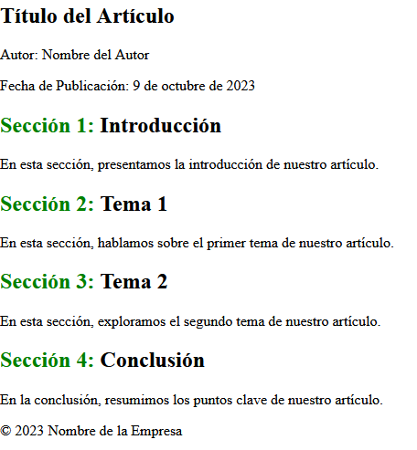

<h1 align="center">Funciones</h1>

<h2>📑 Contenido</h2>

- [¿Qué son las funciones CSS?](#qué-son-las-funciones-css)
- [Algunas funciones CSS](#algunas-funciones-css)
  - [max() y min()](#max-y-min)
  - [attr()](#attr)
  - [calc()](#calc)
  - [counter()](#counter)

## ¿Qué son las funciones CSS?

En CSS hay ciertas características y propiedades en CSS que pueden considerarse similares a funciones o que permiten realizar tareas específicas. A diferencia de los lenguajes de programación como JavaScript, CSS no tiene funciones en el sentido tradicional.

Estas características proporcionan una forma de realizar tareas específicas de estilo y efectos en una página web. Además, puedes combinar estas funciones con selectores y propiedades CSS para controlar la apariencia y el comportamiento de los elementos HTML en tu sitio web.

En los apuntes de colores se ven algunos ejemplos sobre funciones de color:

```css
/* Crear un color RGBA con transparencia */
background-color: rgba(255, 0, 0, 0.5);

/* Usar la variable CSS para definir un color personalizado */
color: var(--color-primario);
```

## Algunas funciones CSS

### max() y min()

La función` max()` o` min()` en CSS se utiliza para definir el valor máximo o mínimo entre dos o más valores. Puedes usar `max()` o `min()` en propiedades CSS que aceptan valores numéricos, como ancho (width), alto (height), tamaño de fuente (font-size), margen (margin), entre otras.

```css
/* Ejemplo con max() */
div {
  width: max(300px, 50%);
}
```

> [!NOTE]
>
> Es útil cuando deseas establecer límites en las dimensiones o valores de estilo, garantizando que un elemento no exceda ciertos valores máximos o mínimos, lo que puede ser especialmente útil en diseños web responsivos.

### attr()

La función `attr()` se utiliza para recuperar y utilizar el valor de un atributo HTML de un elemento y luego aplicar ese valor a una propiedad de estilo CSS. Esto es útil cuando deseas utilizar el valor de un atributo HTML, como un atributo personalizado o un atributo estándar, en la estilización de elementos HTML.

```html
<!-- data-color = atributo personalizado -->
<div data-color="blue">Este es un div con un atributo personalizado.</div>
```

```css
div {
  background-color: attr(data-color);
  color: white;
  padding: 10px;
}
```

### calc()

La función `calc()` permite realizar cálculos matemáticos dentro de las declaraciones de estilo. Esto es útil para definir valores de propiedades CSS de forma dinámica, basados en cálculos que involucran dimensiones, números y/o porcentajes.

```css
/* En este ejemplo, el ancho del elemento <div> será igual al 50% del ancho de su contenedor menos 20 píxeles. */
div {
  width: calc(50% - 20px);
}
```

```css
/* Calculando el margen en base a variables */
:root {
  --margen-horizontal: 10px;
}

div {
  margin: calc(var(--margen-horizontal) * 2) 0;
}
```

### counter()

La función `counter()` en CSS se utiliza para mostrar los valores de los contadores en el contenido de un elemento HTML. Es especialmente útil cuando deseas numerar automáticamente partes de un documento, y mostrar esos números en el contenido.

**Ejemplo: enumerar secciones(section)**

```html
<!-- HTML -->
<article>
  <header>
    <h1>Título del Artículo</h1>
    <p>Autor: Nombre del Autor</p>
    <p>Fecha de Publicación: 9 de octubre de 2023</p>
  </header>

  <section>
    <h2>Introducción</h2>
    <p>En esta sección, presentamos la introducción de nuestro artículo.</p>
  </section>

  <section>
    <h2>Tema 1</h2>
    <p>En esta sección, hablamos sobre el primer tema de nuestro artículo.</p>
  </section>

  <section>
    <h2>Tema 2</h2>
    <p>En esta sección, exploramos el segundo tema de nuestro artículo.</p>
  </section>

  <section>
    <h2>Conclusión</h2>
    <p>En la conclusión, resumimos los puntos clave de nuestro artículo.</p>
  </section>

  <footer>
    <p>© 2023 Nombre de la Empresa</p>
  </footer>
</article>
```

```css
article {
  counter-reset: section;
}

h2::before {
  counter-increment: section;
  content: "Sección " counter(section) ": ";
  color: green;
}
```


