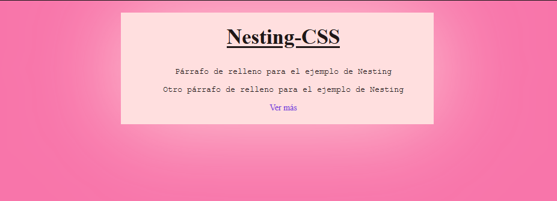

<h1 align="center">Nesting</h1>

<h2>📑 Contenido</h2>

- [¿Qué es nesting?](#qué-es-nesting)
  - [Ejemplo](#ejemplo)
- [Cuando usar un ampersand(\&)](#cuando-usar-un-ampersand)

## ¿Qué es nesting?

El "nesting" en CSS se refiere a la práctica de anidar selectores CSS dentro de otros selectores. Esto se hace para aplicar estilos específicos a elementos que están anidados dentro de otros elementos. Esta característica se ha vuelto más popular con la introducción de preprocesadores CSS como Sass y Less, que permiten el anidamiento de selectores para una escritura de código más limpia y organizada.

### Ejemplo

```html
<!-- HTML -->
<div class="contenedor">
  <main>
    <article>
      <h1 class="titulo">Nesting-CSS</h1>
      <p>Párrafo de relleno para el ejemplo de Nesting</p>
      <p>Otro párrafo de relleno para el ejemplo de Nesting</p>
      <a href="#">Ver más</a>
    </article>
  </main>
</div>
```

```css
/* CSS Tradicional */
body {
  background-color: #f875aa;
  color: #1f1717;
  font-size: 14px;
  margin: 0;
}

.contenedor {
  width: 500px;
  margin: 20px auto;
  background-color: #ffdfdf;
  padding: 10px;
  box-shadow: 0 0 150px #ffdfdf;
}

.contenedor main {
  width: 100%;
  padding: 10px;
}

.contenedor main article {
  text-align: center;
}

.contenedor main article .titulo {
  margin-top: 0px;
  font-size: 35px;
  text-decoration: underline;
}

.contenedor main article > p {
  font-family: "Courier New", Courier, monospace;
}
.contenedor main article a {
  text-decoration: none;
  color: #7743db;
}
.contenedor main article a:hover {
  border: 4px dashed #7743db;
  color: #1f1717;
}
```

```css
/* CSS Nesting */
body {
  background-color: #f875aa;
  color: #1f1717;
  font-size: 14px;
  margin: 0;
}

.contenedor {
  width: 500px;
  margin: 20px auto;
  background-color: #ffdfdf;
  padding: 10px;
  box-shadow: 0 0 150px #ffdfdf;

  & main {
    width: 100%;
    padding: 10px;

    & article {
      text-align: center;

      .titulo {
        margin-top: 0px;
        font-size: 35px;
        text-decoration: underline;
      } /* Cierre .titulo */

      > p {
        font-family: "Courier New", Courier, monospace;
      }

      & a {
        text-decoration: none;
        color: #7743db;

        &:hover {
          border: 4px dashed #7743db;
          color: #1f1717;
        } /* Cierre a:hover */
      } /* Cierre a */
    } /* Cierre article */
  } /* Cierre main */
} /* Cierre .contenedor */
```

En ambos casos el resultado es el mismo



## Cuando usar un ampersand(&)

Se utiliza el ampersand `&` en los elementos directos que no sean `clases(.), id(#) , selectores combinadores(espacios, >, +, ~) y reglas@(@media,@scope,@layer,@container)`. El ampersand también se puede utilizar para **anidar sobre el padre**, en este caso el ampersand se coloca detrás `.titulo &`. De esta forma se pueden crear anidaciones menos directas.

Con las Pseudoclases hay que tener cuidado ya que en algunos casos se puede omitir el ampersand.

Si quieres aplicar un hover a los que están dentro del contenedor .contenedor :hover en este caso se puede omitir. Pero si lo que buscas es aplicar .contenedor:hover es necesario usar el ampersand.

```css
/* .contenedor :hover */
.contenedor {
  background: red;

  :hover {
    background: blue;
  }
}

/* .contenedor:hover */
.contenedor {
  background: red;

  &:hover {
    background: blue;
  }
}
```

> [!NOTE]
>
> Al usar el :hover sin el ampersand lo que hace es aplicar la pseudoclase al selector descendiente(selector con espacios entre ellos).
