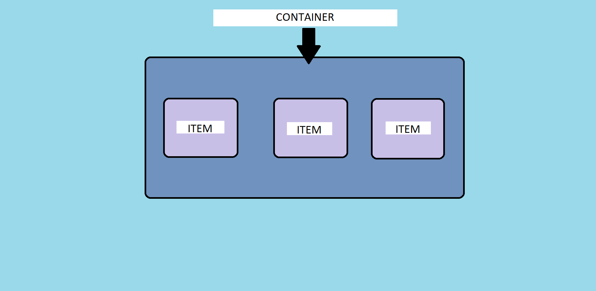

<h1 align="center">Flexbox</h1>

<h2>📑 Contenido</h2>

- [Flexbox](#flexbox)
- [Objetivo](#objetivo)
- [Flexbox y Grid](#flexbox-y-grid)

## Flexbox

Flexbox es un modelo unidimensional de layout(la manera en que están distribuidos los elementos y las formas dentro de un diseño). Si queremos maquetar diseños de una dimension, una fila o una columna, este modulo es el modulo que usaremos. Para aplicar Flexbox lo hacemos mediante la propiedad `display`.

> Sintaxis: `display: flex;`

Flexbox necesita un elemento padre y mínimo un hijo.

- **Contenedor padre(Flex Container):** Contiene los llamados elementos
  flexibles.

- **Contenedores hijos (Flex Items):** Estos son elementos dentro del
  contenedor.

> [!NOTE]
>
> Los Hijos flex ignoran `float`, `clear`,`vertical-align`.  
> Por defecto el tamaño de los hijos ocupa el tamaño de su contenido.

## Objetivo

Flexbox tiene como objetivo proporcionar una forma más eficiente de diseñar, alinear y distribuir el espacio entre los elementos en un contenedor, incluso cuando su tamaño es desconocido y/o dinámico (de ahí la palabra “flexible”).

La idea principal detrás del diseño flexible es darle al contenedor la capacidad de alterar el ancho/alto (y el orden) de sus elementos para llenar mejor el espacio disponible (principalmente para adaptarse a todo tipo de dispositivos de visualización y tamaños de pantalla). Un contenedor flexible expande los elementos para llenar el espacio libre disponible o los encoge para evitar que se desborden.

## Flexbox y Grid

El diseño Flexbox es más apropiado para los componentes de una aplicación y diseños de pequeña escala, mientras que el diseño [Grid]() está pensado para diseños de mayor escala.

Flexbox es unidimensional, mientras que CSS Grid es bidimensional. Flexbox establece elementos a lo largo del eje horizontal o vertical, lo que te exige a decidir si deseas un diseño basado en filas o en columnas.

> [!NOTE]
>
> Debes evaluar cada diseño de página individualmente, caso por caso, para elegir la mejor opción. Ninguno sustituye al otro, son complementarios.
