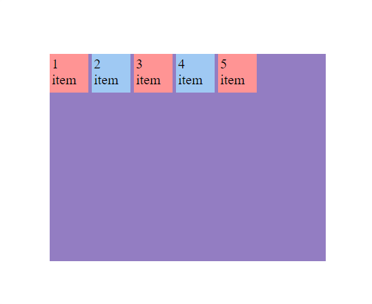
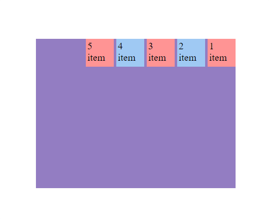
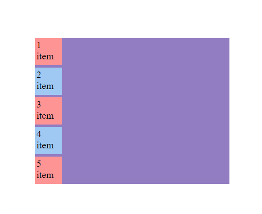
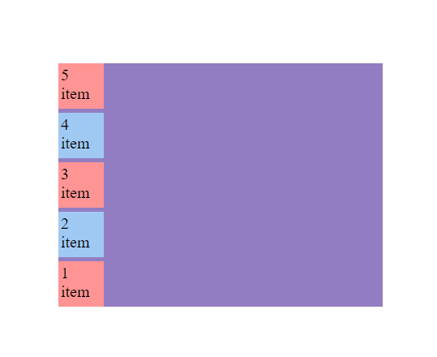
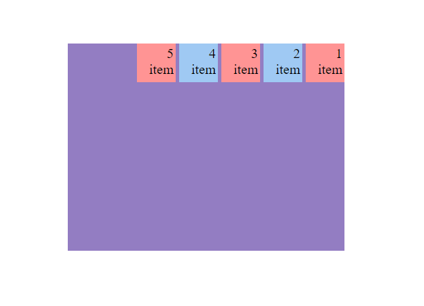

<h1 align="center">Flujo de flexbox</h1>

<h2>📑 Contenido</h2>

- [Flujo de flexbox](#flujo-de-flexbox)
- [Eje principal](#eje-principal)
- [Eje transversal](#eje-transversal)
- [Resumen](#resumen)
- [Flex direction](#flex-direction)
  - [Row (por defecto)](#row-por-defecto)
  - [Row reverse](#row-reverse)
  - [Column](#column)
  - [Column reverse](#column-reverse)
- [Dirección de escritura](#dirección-de-escritura)

## Flujo de flexbox

En Flexbox, entender los conceptos de eje principal y eje transversal es esencial para controlar la disposición de los elementos.

## Eje principal

El eje principal es el eje a lo largo del cual los elementos flexibles se colocan en un contenedor Flexbox. La dirección del eje principal depende de la propiedad `flex-direction`.

- **row (predeterminado):** El eje principal es horizontal, de izquierda a derecha.
- **row-reverse:** El eje principal es horizontal, pero de derecha a izquierda.
- **column:** El eje principal es vertical, de arriba a abajo.
- **column-reverse:** El eje principal es vertical, pero de abajo a arriba.

## Eje transversal

El eje transversal es perpendicular al eje principal. Depende de la dirección del eje principal.

- Si el eje principal es horizontal (`row` o `row-reverse`), el eje transversal es vertical.
- Si el eje principal es vertical (`column` o `column-reverse`), el eje transversal es horizontal.

## Resumen

- **Eje Principal (Main Axis):** La dirección en la que los elementos hijos de un contenedor flex se organizan. Determinado por `flex-direction`.

- **Eje Transversal (Cross Axis):** La dirección perpendicular al eje principal. Las propiedades align-items y align-content controlan la alineación en este eje.

## Flex direction

Flex-direction modifica el eje principal.
Es important saber cual es el eje principal para poder mover los items de forma correcta.

- Cuando esta en row o row-reverse el eje principal sera el horizontal, **la fila**.
- Cuando esta en column o column-reverse el eje principal sera el vertical, **la columna**.

Sintaxis: `flex-direction: row` | `row-reverse` | `column` | `column-reverse`;

Ejemplos:

```HTML
<!-- HTML -->
    <div class="flex-container">
      <div class="flex-item">1 item</div>
      <div class="flex-item">2 item</div>
      <div class="flex-item">3 item</div>
      <div class="flex-item">4 item</div>
      <div class="flex-item">5 item</div>
    </div>
```

```CSS
/* CSS */
   .flex-container {
        width: 400px;
        height: 300px;
        margin: 15% auto;
        display: flex;
        gap: 5px;
        flex-direction: row;
        background-color: #937dc2;
      }

      .flex-item {
        width: 50px;
        height: 50px;
        padding: 3px;
        font-size: 20px;
      }
      .flex-item:nth-child(even) {
        background-color: #9fc9f3;
      }

      .flex-item:nth-child(odd) {
        background-color: #ff9494;
      }
```

### Row (por defecto)



---

### Row reverse



---

### Column



---

### Column reverse



## Dirección de escritura

A la hora de utilizar flex es importante tener en cuenta la dirección de escritura. Si utilizamos la propiedad `direction: rtl` afectará la dirección en la que se colocan los elementos flexibles dentro de un contenedor con `display: flex`. Al establecer `direction: rtl` (derecha a izquierda), cambiará la dirección de escritura de los elementos flexibles y, por lo tanto, también influirá en su disposición dentro del contenedor.

Ejemplo:

```html
<!-- HTML -->
<div class="flex-container">
  <div class="flex-item">1 item</div>
  <div class="flex-item">2 item</div>
  <div class="flex-item">3 item</div>
  <div class="flex-item">4 item</div>
  <div class="flex-item">5 item</div>
</div>
```

```css
/* CSS */
.flex-container {
  width: 400px;
  height: 300px;
  margin: 15% auto;
  display: flex;
  gap: 5px;
  flex-direction: row;
  background-color: #937dc2;
  /* Cambiar dirección */
  direction: rtl;
}

.flex-item {
  width: 50px;
  height: 50px;
  padding: 3px;
  font-size: 20px;
}
.flex-item:nth-child(even) {
  background-color: #9fc9f3;
}

.flex-item:nth-child(odd) {
  background-color: #ff9494;
}
```



> [!NOTE]
>
> Lo mismo pasaría con la propiedad `writing-mode: vertical-lr;` <br>
> La dirección pasaría a ser vertical de izquierda a derecha(Arriba-Abajo).
