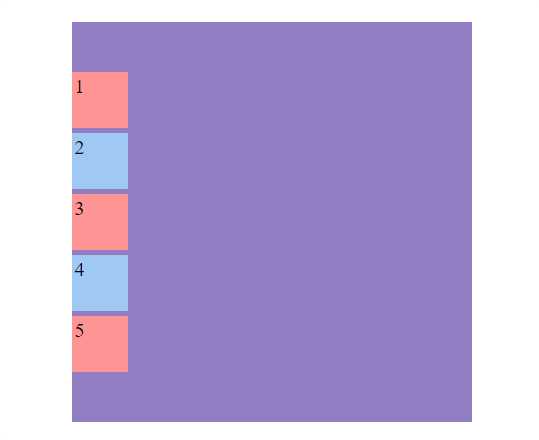

<h1 align="center">Eje principal</h1>

<h2>📑 Contenido</h2>

- [Justify content](#justify-content)
- [Eje principal row](#eje-principal-row)
- [Eje principal column](#eje-principal-column)

## Justify content

Con `justify-content` movemos el **eje principal** de forma horizontal.

> Sintaxis: `justify-content: flex-start | flex-end | center | space-between | space-around | space-evenly | start | end | left | right`

## Eje principal row

Cuando el eje principal es `row`, los elementos flexibles dentro del contenedor se disponen horizontalmente de izquierda a derecha. Este es el valor predeterminado para la propiedad `flex-direction` en CSS Flexbox.

**Código**

```html
<!-- HTML -->
<div class="flex-container">
  <div class="flex-item">1 item</div>
  <div class="flex-item">2 item</div>
  <div class="flex-item">3 item</div>
  <div class="flex-item">4 item</div>
  <div class="flex-item">5 item</div>
</div>
```

```css
/* CSS */
.flex-container {
  width: 400px;
  height: 300px;
  margin: 15% auto;
  display: flex;
  gap: 5px;
  flex-direction: row;
  justify-content: flex-start;
  background-color: #937dc2;
}

.flex-item {
  width: 50px;
  height: 50px;
  padding: 3px;
  font-size: 20px;
}
.flex-item:nth-child(even) {
  background-color: #9fc9f3;
}

.flex-item:nth-child(odd) {
  background-color: #ff9494;
}
```

---

**Flex-Start(por defecto)**


---

**Center**


---

**Flex-End**


---

**Space-Between**


---

**Space-Around**


---

**Space-Evenly**


> [!NOTE]
>
> La diferencia entre `evenly` y `around` es cómo se distribuye el espacio en los extremos del contenedor. `Space-around` deja menos espacio en los extremos en comparación con el espacio entre los elementos.

---

## Eje principal column

Cuando el eje principal es column, los elementos flexibles dentro del contenedor se disponen verticalmente de arriba hacia abajo(el eje principal cambia). Esto se establece utilizando la propiedad `flex-direction: column`.

**Código**

```html
<!-- HTML -->
<div class="flex-container">
  <div class="flex-item">1 item</div>
  <div class="flex-item">2 item</div>
  <div class="flex-item">3 item</div>
  <div class="flex-item">4 item</div>
  <div class="flex-item">5 item</div>
</div>
```

```css
/* CSS */
.flex-container {
  width: 400px;
  height: 300px;
  margin: 15% auto;
  display: flex;
  gap: 5px;
  flex-direction: column;
  justify-content: flex-start;
  background-color: #937dc2;
}

.flex-item {
  width: 50px;
  height: 50px;
  padding: 3px;
  font-size: 20px;
}
.flex-item:nth-child(even) {
  background-color: #9fc9f3;
}

.flex-item:nth-child(odd) {
  background-color: #ff9494;
}
```

**Flex-Start(por defecto)**


---

**Center**



---

**Flex-End**


---

**Space-Between**


---

**Space-Around**


---

**Space-Evenly**


