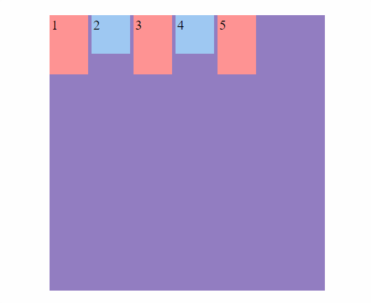
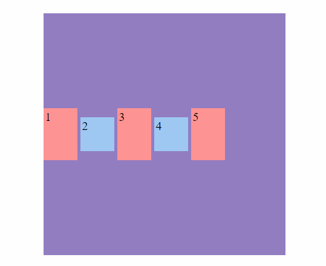
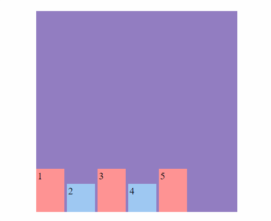
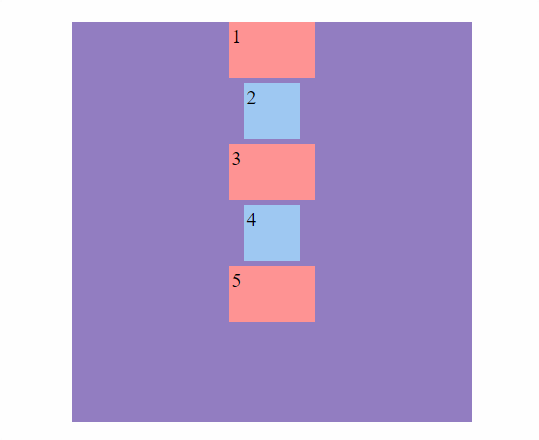
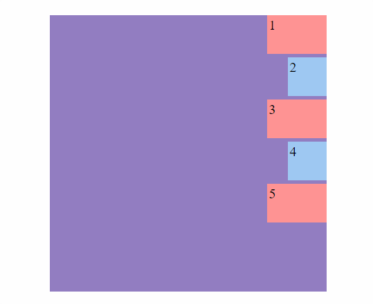
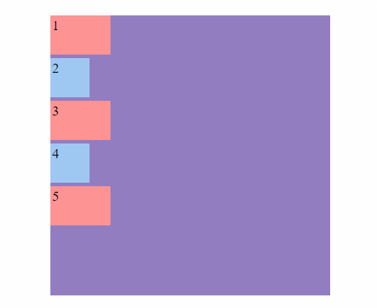
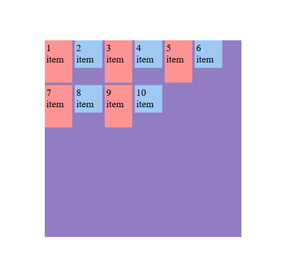
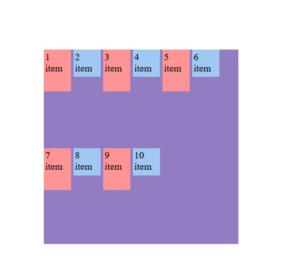
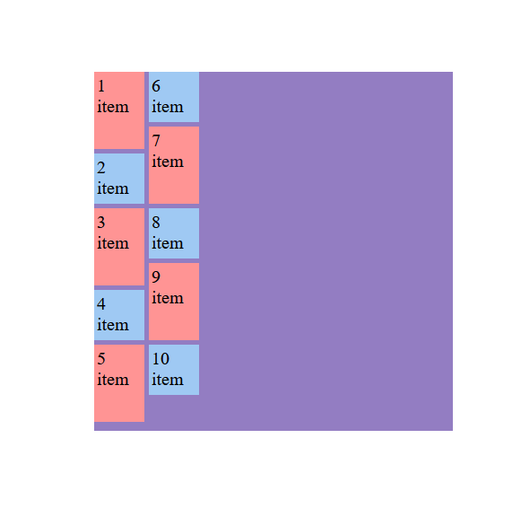
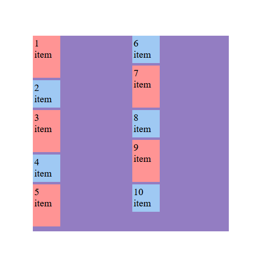

<h1 align="center">Eje transversal</h1>

<h2>📑 Contenido</h2>

- [Eje transversal](#eje-transversal)
- [Align items](#align-items)
  - [Eje principal row](#eje-principal-row)
  - [Eje principal column](#eje-principal-column)
- [Align content](#align-content)
- [Diferencias entre align-items y align-content](#diferencias-entre-align-items-y-align-content)
  - [align-items](#align-items-1)
  - [align-content](#align-content-1)

## Eje transversal

En el contexto de Flexbox, el eje transversal (o eje cruzado) es perpendicular al eje principal. La alineación a lo largo del eje transversal se controla principalmente mediante las propiedades `align-items` y `align-content`.

## Align items

Esta propiedad alinea los elementos flexibles a lo largo del eje transversal dentro de un contenedor flex.

Sintaxis: `align-items: stretch` | `flex-start` | `flex-end` | `center` | `baseline` | `first baseline` | `last baseline` | `start` | `end`;

### Eje principal row

```html
<!-- HTML -->
<div class="flex-container">
  <div class="flex-item">1 item</div>
  <div class="flex-item">2 item</div>
  <div class="flex-item">3 item</div>
  <div class="flex-item">4 item</div>
  <div class="flex-item">5 item</div>
</div>
```

```css
/* CSS */
.flex-container {
  width: 400px;
  height: 400px;
  margin: 15% auto;
  display: flex;
  gap: 5px;
  flex-direction: row;
  align-items: flex-start;
  background-color: #937dc2;
}

.flex-item {
  width: 50px;
  height: 50px;
  padding: 3px;
  font-size: 20px;
}
.flex-item:nth-child(even) {
  background-color: #9fc9f3;
}

.flex-item:nth-child(odd) {
  background-color: #ff9494;
  height: 80px;
}
```

---

**Flex-Start(por defecto)**



---

**Center**



---

**Flex-End**



---

**Baseline**


---

**Stretch**


---

### Eje principal column

**Código**

```html
<!-- HTML -->
<div class="flex-container">
  <div class="flex-item">1 item</div>
  <div class="flex-item">2 item</div>
  <div class="flex-item">3 item</div>
  <div class="flex-item">4 item</div>
  <div class="flex-item">5 item</div>
</div>
```

```css
/* CSS */
.flex-container {
  width: 400px;
  height: 400px;
  margin: 15% auto;
  display: flex;
  gap: 5px;
  flex-direction: column;
  align-items: flex-start;
  background-color: #937dc2;
}

.flex-item {
  width: 50px;
  height: 50px;
  padding: 3px;
  font-size: 20px;
}
.flex-item:nth-child(even) {
  background-color: #9fc9f3;
}

.flex-item:nth-child(odd) {
  background-color: #ff9494;
  width: 80px;
}
```

---

**Flex-Start(por defecto)**


---

**Center**



---

**Flex-End**



---

**Baseline**



---

**Stretch**


## Align content

Esta propiedad alinea las líneas de elementos dentro de un contenedor flex cuando hay espacio extra en el eje transversal y se están utilizando múltiples líneas.

**Código**

```html
<div class="flex-container">
  <div class="flex-item">1 item</div>
  <div class="flex-item">2 item</div>
  <div class="flex-item">3 item</div>
  <div class="flex-item">4 item</div>
  <div class="flex-item">5 item</div>
  <div class="flex-item">6 item</div>
  <div class="flex-item">7 item</div>
  <div class="flex-item">8 item</div>
  <div class="flex-item">9 item</div>
  <div class="flex-item">10 item</div>
</div>
```

```css
.flex-container {
  width: 400px;
  height: 400px;
  margin: 15% auto;
  display: flex;
  gap: 5px;
  flex-direction: row;
  flex-wrap: wrap;
  align-content: flex-start;
  background-color: #937dc2;
}

.flex-item {
  width: 50px;
  height: 50px;
  padding: 3px;
  font-size: 20px;
}
.flex-item:nth-child(even) {
  background-color: #9fc9f3;
}

.flex-item:nth-child(odd) {
  background-color: #ff9494;
  height: 80px;
}
```

**Align-Content Start(ROW)**



---

**Align-Item Start(ROW)**



---

**Align-Content Start(COLUMN)**



---

**Align-Item Start(COLUMN)**



---

## Diferencias entre align-items y align-content

### align-items

- **Propósito:** Alinea los elementos flexibles dentro de una sola línea del contenedor flex a lo largo del eje transversal.
- **Aplicación:** Se aplica a todos los elementos hijos dentro de un contenedor flex, sin importar si hay una o múltiples líneas.

### align-content

- **Propósito:** Alinea las líneas de elementos dentro de un contenedor flex cuando hay espacio extra en el eje transversal. Solo tiene efecto cuando el contenedor tiene múltiples líneas (cuando `flex-wrap` está en `wrap` o `wrap-reverse`).
- **Aplicación:** Se aplica a la alineación de líneas de elementos, no a los elementos individuales.
