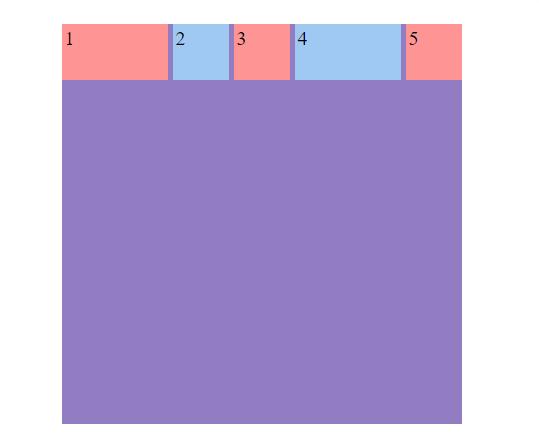
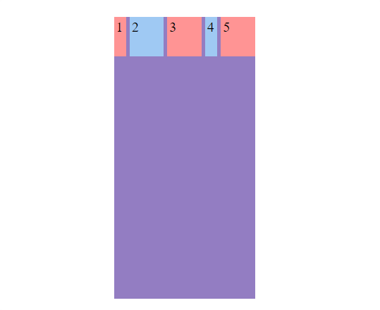
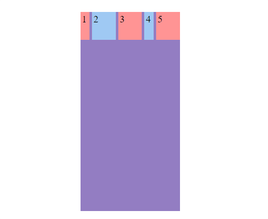
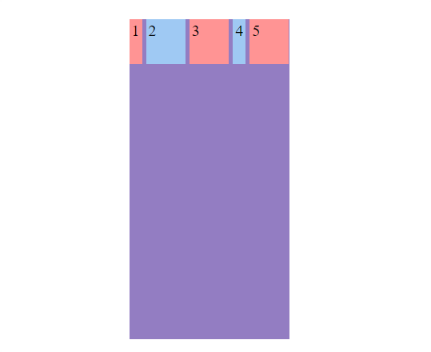

<h1 align="center">Modificar tamaños de los hijos</h1>

<h2>📑 Contenido</h2>

- [Modificar tamaños](#modificar-tamaños)
  - [Flex-grow](#flex-grow)
  - [Flex-shrink](#flex-shrink)
  - [Flex-basis](#flex-basis)
  - [Flex](#flex)

## Modificar tamaños

En ocasiones en el layout a los hijos les sobra o falta espacio disponible. Con Flexbox podemos controlar el tamaño para ajustar mejor los items.

### Flex-grow

Define el tamaño que crecerá un hijo, en relación a sus hermanos. Siempre que tengan espacio disponible.

```html
<!-- HTML -->
<div class="flex-container">
  <div class="flex-item grow">1</div>
  <div class="flex-item">2</div>
  <div class="flex-item">3</div>
  <div class="flex-item grow">4</div>
  <div class="flex-item">5</div>
</div>
```

```css
/* CSS */
.flex-container {
  width: 400px;
  height: 400px;
  margin: 15% auto;
  display: flex;
  gap: 5px;
  justify-content: center;
  background-color: #937dc2;
}

.flex-item {
  width: 50px;
  height: 50px;
  padding: 3px;
  font-size: 20px;
}
.flex-item:nth-child(even) {
  background-color: #9fc9f3;
}

.flex-item:nth-child(odd) {
  background-color: #ff9494;
}

.grow {
  flex-grow: 1;
}
```

**Resultado**



---

### Flex-shrink

Define el tamaño que decrecerá un hijo, en relación a sus hermanos. Cuando falte espacio disponible.

Ejemplo:

```html
<!-- HTML -->
<div class="flex-container">
  <div class="flex-item shrink">1</div>
  <div class="flex-item">2</div>
  <div class="flex-item">3</div>
  <div class="flex-item shrink">4</div>
  <div class="flex-item">5</div>
</div>
```

```css
/* CSS */
.flex-container {
  width: 200px;
  height: 400px;
  margin: 15% auto;
  display: flex;
  gap: 5px;
  justify-content: center;
  background-color: #937dc2;
}

.flex-item {
  width: 50px;
  height: 50px;
  padding: 3px;
  font-size: 20px;
}
.flex-item:nth-child(even) {
  background-color: #9fc9f3;
}

.flex-item:nth-child(odd) {
  background-color: #ff9494;
}

.shrink {
  flex-shrink: 5;
}
```

**Resultado**



---

### Flex-basis

Define el tamaño inicial hijo, en relación a sus hermanos. El valor por defecto es `auto`

Ejemplo:

```html
<!-- HTML -->
<div class="flex-container">
  <div class="flex-item basis">1</div>
  <div class="flex-item">2</div>
  <div class="flex-item">3</div>
  <div class="flex-item basis">4</div>
  <div class="flex-item">5</div>
</div>
```

```css
/* CSS */
.flex-container {
  width: 200px;
  height: 400px;
  margin: 15% auto;
  display: flex;
  gap: 5px;
  justify-content: center;
  background-color: #937dc2;
}

.flex-item {
  width: 50px;
  height: 50px;
  padding: 3px;
  font-size: 20px;
}
.flex-item:nth-child(even) {
  background-color: #9fc9f3;
}

.flex-item:nth-child(odd) {
  background-color: #ff9494;
}

.basis {
  flex-basis: 15px;
}
```

**Resultado**



---

### Flex

Método abreviado, combina `flex-grow, flex-shrink y flex-basis`.

Ejemplo:

```html
<!-- HTML -->
<div class="flex-container">
  <div class="flex-item flex">1</div>
  <div class="flex-item">2</div>
  <div class="flex-item">3</div>
  <div class="flex-item flex">4</div>
  <div class="flex-item">5</div>
</div>
```

```css
/* CSS */
.flex-container {
  width: 200px;
  height: 400px;
  margin: 15% auto;
  display: flex;
  gap: 5px;
  justify-content: center;
  background-color: #937dc2;
}

.flex-item {
  width: 50px;
  height: 50px;
  padding: 3px;
  font-size: 20px;
}
.flex-item:nth-child(even) {
  background-color: #9fc9f3;
}

.flex-item:nth-child(odd) {
  background-color: #ff9494;
}

.flex {
  flex: 1 1 0px;
}
```

**Resultado**


