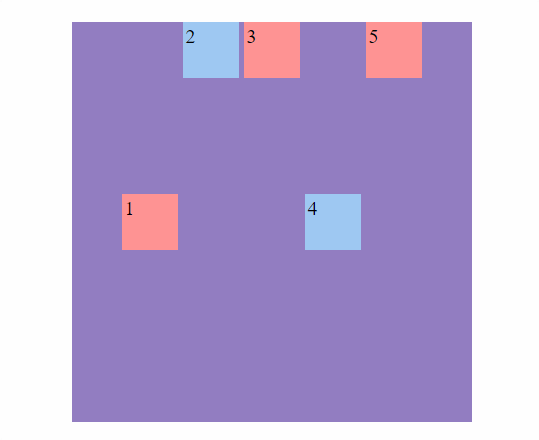
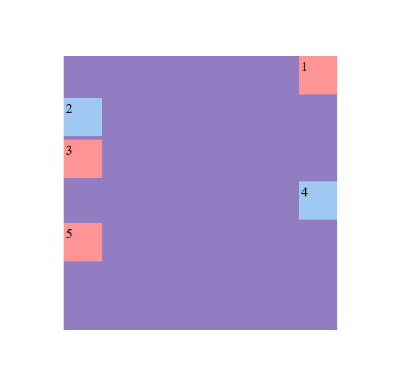

<h1 align="center">Mover hijos</h1>

<h2>📑 Contenido</h2>

- [Mover hijos individual](#mover-hijos-individual)
- [Buenas prácticas](#buenas-prácticas)

## Mover hijos individual

Con `align-self` movemos los hijos de forma individual.

Sintaxis: `align-self: auto` | `flex-start` | `flex-end` | `center` | `baseline` | `stretch`;

Ejemplo:

```html
<!-- HTML -->
<div class="flex-container">
  <div class="flex-item self">1</div>
  <div class="flex-item">2</div>
  <div class="flex-item">3</div>
  <div class="flex-item self">4</div>
  <div class="flex-item">5</div>
</div>
```

```css
/* CSS */
.flex-container {
  width: 400px;
  height: 400px;
  margin: 15% auto;
  display: flex;
  gap: 5px;
  flex-direction: row;
  background-color: #937dc2;
}

.flex-item {
  width: 50px;
  height: 50px;
  padding: 3px;
  font-size: 20px;
}
.flex-item:nth-child(even) {
  background-color: #9fc9f3;
}

.flex-item:nth-child(odd) {
  background-color: #ff9494;
}

.self {
  align-self: center;
}
```

**Align-Self:Center(Row)**



---

**Align-Self:Center(Column)**



## Buenas prácticas

- Evitar el uso excesivo de `align-self` cuando se puede lograr lo mismo a nivel de `align-items` en el contenedor.

- Mantener la consistencia visual al combinarlo con otros estilos.
