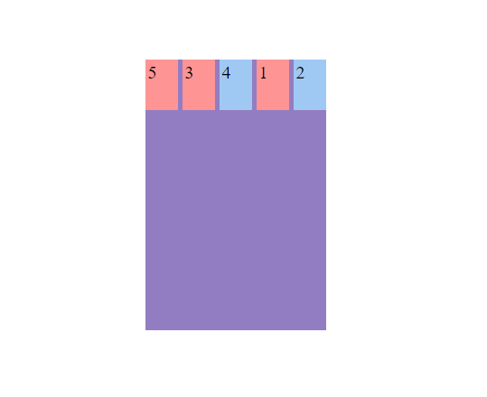

<h1 align="center">Ordenar los items</h1>

<h2>📑 Contenido</h2>

- [Ordenar los items](#ordenar-los-items)
- [Buenas prácticas](#buenas-prácticas)

## Ordenar los items

Flexbox permite modificar el orden de los items mediante la propiedad `order`.

Ejemplo:

```html
<!-- HTML -->
<div class="flex-container">
  <div class="flex-item">1</div>
  <div class="flex-item">2</div>
  <div class="flex-item">3</div>
  <div class="flex-item">4</div>
  <div class="flex-item">5</div>
</div>
```

```css
/* CSS */
.flex-container {
  width: 200px;
  height: 300px;
  margin: 15% auto;
  display: flex;
  gap: 5px;
  justify-content: center;
  background-color: #937dc2;
}

.flex-item {
  width: 50px;
  height: 50px;
  padding: 3px;
  font-size: 20px;
}
.flex-item:nth-child(even) {
  background-color: #9fc9f3;
}

.flex-item:nth-child(odd) {
  background-color: #ff9494;
}

.flex-item:nth-child(1) {
  order: 3;
}

.flex-item:nth-child(2) {
  order: 4;
}

.flex-item:nth-child(3) {
  order: 1;
}

.flex-item:nth-child(4) {
  order: 2;
}
```



## Buenas prácticas

- Evitar abusar de `order` para mantener el código legible.

- **Consistencia entre diseño y contenido:** La posición visual debería alinearse con el flujo lógico del contenido para mejorar la experiencia de usuario.
