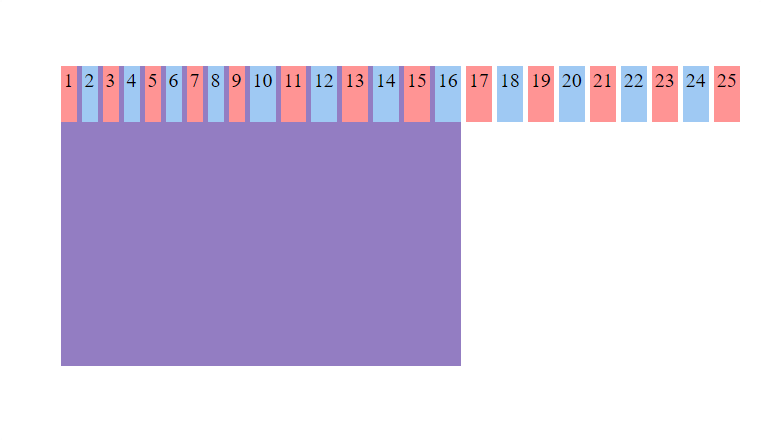
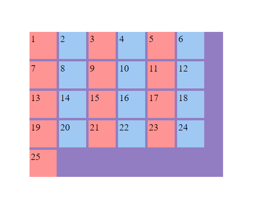
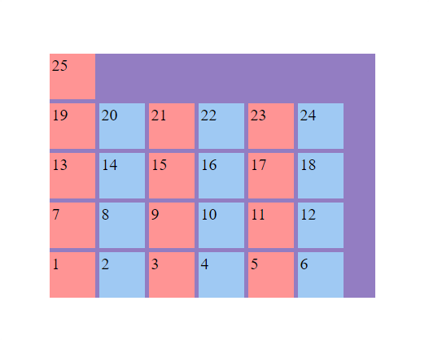

<h1 align="center">Flex wrap</h1>

<h2>📑 Contenido</h2>

- [Flex-wrap](#flex-wrap)
- [Buenas prácticas](#buenas-prácticas)

## Flex-wrap

Flex-wrap especifica si los elementos hijos pueden fluir en multiples líneas o se ven obligados a mantenerse en una línea. Esta propiedad es muy util para crear un diseño web adaptable. Por defecto los items no fluyen `nowrap`.

Sintaxis: `flex-wrap: nowrap` | `wrap` | `wrap-reverse`;

Ejemplo:

```html
<!-- HTML -->
<div class="flex-container">
  <div class="flex-item">1</div>
  <div class="flex-item">2</div>
  <div class="flex-item">3</div>
  <div class="flex-item">4</div>
  <div class="flex-item">5</div>
  <div class="flex-item">6</div>
  <div class="flex-item">7</div>
  <div class="flex-item">8</div>
  <div class="flex-item">9</div>
  <div class="flex-item">10</div>
  <div class="flex-item">11</div>
  <div class="flex-item">12</div>
  <div class="flex-item">13</div>
  <div class="flex-item">14</div>
  <div class="flex-item">15</div>
  <div class="flex-item">16</div>
  <div class="flex-item">17</div>
  <div class="flex-item">18</div>
  <div class="flex-item">19</div>
  <div class="flex-item">20</div>
  <div class="flex-item">21</div>
  <div class="flex-item">22</div>
  <div class="flex-item">23</div>
  <div class="flex-item">24</div>
  <div class="flex-item">25</div>
</div>
```

```css
/* CSS */
.flex-container {
  width: 400px;
  height: 300px;
  margin: 15% auto;
  display: flex;
  flex-wrap: nowrap;
  gap: 5px;
  background-color: #937dc2;
}

.flex-item {
  width: 50px;
  height: 50px;
  padding: 3px;
  font-size: 20px;
}
.flex-item:nth-child(even) {
  background-color: #9fc9f3;
}

.flex-item:nth-child(odd) {
  background-color: #ff9494;
}
```

---

**nowrap**



---

**wrap**



---

**wrap-reverse**



## Buenas prácticas

- Planificar cómo afecta `flex-wrap` al diseño responsivo, asegurándose de que los elementos mantengan proporciones adecuadas.
