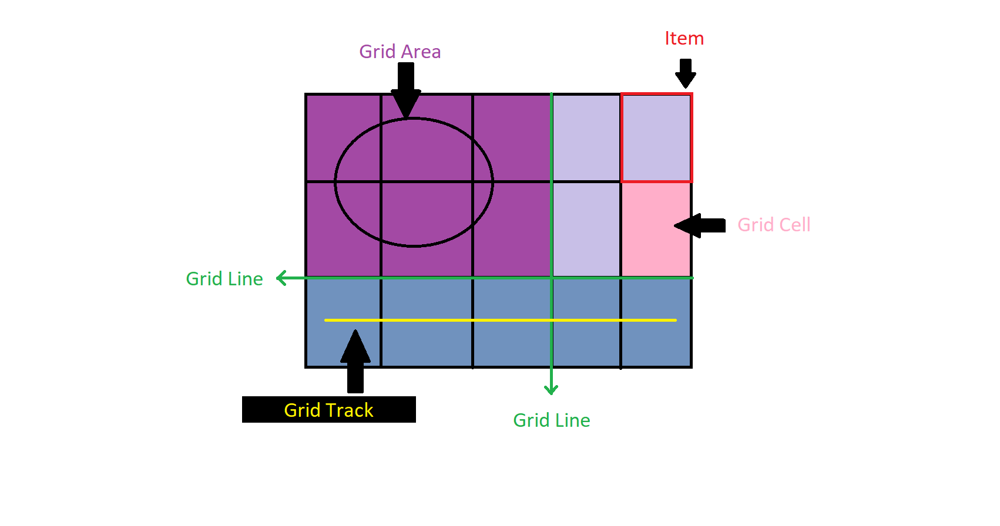
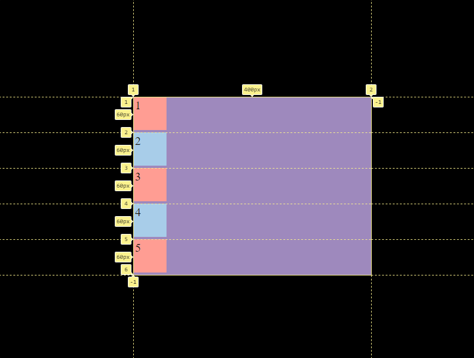

<h1 align="center">Grid</h1>

<h2>📑 Contenido</h2>

- [Grid](#grid)
  - [Partes importantes de grid](#partes-importantes-de-grid)
- [Grid y Flexbox](#grid-y-flexbox)

## Grid

Grid es un modelo bidimensional para crear rejillas en varias filas y columnas al mismo tiempo. Con grid creamos cuadriculas donde colocar elementos para maquetar. No es una alternativa a Flexbox, se complementan, en algunas ocasiones usaras Flexbox y en otras grid.
Grid es una buena opción para la construcción general de la página y Flexbox es alineando contenido dentro de elementos. Al aplicar el valor `grid` o `inline-grid` a la propiedad `display` los hijos directos de ese elemento se convierten en elementos grid.

### Partes importantes de grid

- **Grid Line:** Separador de celdas horizontal o vertical. Podemos hacer referencia a una GRID line por número o por nombre.
- **Grid Track:** Nombre genérico para un GRID row o GRID column. Es el espacio vertical u horizontal entre dos GRID lines consecutivas.
- **Grid Cell:** La intersección de un GRID row y un GRID column es llamada GRID cell, es decir, el espacio entre 4 GRID lines.
- **Grid Area:** Cualquier porción del GRID contenida entre 4 GRID lines. Puede contener N número de GRID cells.

> [!NOTE]
>
> A diferencia de flex, grid por defecto coloca los items uno debajo manteniendo el "bloque" del elemento.

## Grid y Flexbox

1. Estructura de diseño

   - CSS Grid se utiliza principalmente para crear diseños bidimensionales, es decir, tanto columnas como filas. Puedes definir fácilmente una cuadrícula de filas y columnas y colocar elementos en cualquier celda de esa cuadrícula.
   - CSS Flexbox se utiliza para crear diseños unidimensionales, generalmente en una fila o columna. Es útil para organizar elementos en una sola dimensión y es especialmente bueno para diseñar elementos en una fila o columna de contenido, como barras de navegación, listas, etc.

2. Control de Elementos

   - CSS Grid ofrece un mayor control sobre el posicionamiento de elementos en una cuadrícula. Puedes especificar el tamaño de las filas y columnas, y posicionar elementos en celdas específicas de la cuadrícula.
   - CSS Flexbox se enfoca en el espacio entre los elementos dentro de una fila o columna, permitiendo que los elementos se ajusten automáticamente para llenar el espacio disponible de manera uniforme.

3. Anidamiento

   - CSS Grid permite anidar cuadrículas dentro de cuadrículas, lo que brinda flexibilidad para crear diseños altamente estructurados y complejos.
   - CSS Flexbox no admite el anidamiento directo de flexbox dentro de otros flexbox. Si necesitas anidar elementos flexbox, generalmente se hace dentro de un contenedor que utiliza Grid.

4. Escenarios de uso

   - CSS Grid es excelente para crear diseños de página en los que necesitas controlar elementos en ambas direcciones (filas y columnas), como diseños de cuadrículas complejas o diseños de mosaicos.
   - CSS Flexbox es útil cuando necesitas organizar elementos en una sola dirección, como la alineación de elementos en una barra de navegación o una lista de elementos.

> [!NOTE]
>
> A menudo se utilizan CSS Grid y CSS Flexbox juntos en un diseño de página para aprovechar sus ventajas respectivas. Por ejemplo, puedes utilizar CSS Grid para el diseño general de la página y CSS Flexbox para organizar elementos dentro de las áreas definidas por la cuadrícula.
