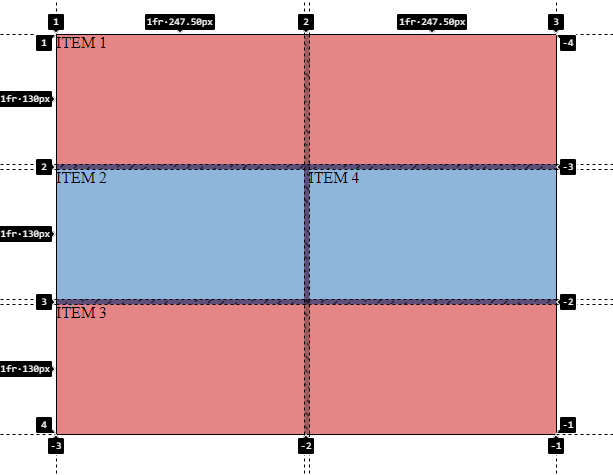
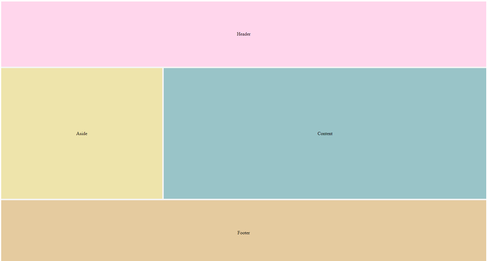

<h1 align="center">Líneas inicio-fin y nombre</h1>

<h2>📑 Contenido</h2>

- [Líneas inicio y fin](#líneas-inicio-y-fin)
- [Líneas por nombre](#líneas-por-nombre)
  - [Ejemplo: layout(Header,Aside,Content,Footer)](#ejemplo-layoutheaderasidecontentfooter)

## Líneas inicio y fin

Usaremos las líneas como referencia para indicar donde empiezan y terminan las columnas y las filas. Con `grid-column-start y grid-column-end` indicaremos el inicio y el final de las columnas, para las filas usaremos `grid-row-start y grid-row-end`. Estas propiedades tienen una version abreviada, `grid-column: inicio / fin;` y `grid-row: inicio / final;`.

Ejemplo

```html
<!-- HTML -->
<div class="wrapper">
  <div class="grid-item">ITEM 1</div>
  <div class="grid-item">ITEM 2</div>
  <div class="grid-item">ITEM 3</div>
  <div class="grid-item">ITEM 4</div>
</div>
```

```css
/* CSS */

.wrapper {
  width: 500px;
  height: 400px;
  background-color: #937dc2;
  display: grid;
  grid-template-columns: 1fr 1fr;
  grid-template-rows: 1fr 1fr 1fr;
  gap: 5px;
}
.grid-item:nth-child(even) {
  background-color: #9fc9f3;
}

.grid-item:nth-child(odd) {
  background-color: #ff9494;
}
.grid-item:nth-child(1) {
  grid-column: 1/3;
}
.grid-item:nth-child(3) {
  grid-column: 1/3;
  grid-row: 3/4;
}
```

Resultado:



## Líneas por nombre

Cuando se crean las líneas automáticamente se les asigna un numero, estos números establecen donde empiezan(Numero positivo) y terminan las lineas(Numero negativo). Sabiendo donde empiezan y terminan las líneas se pueden establecer donde empiezan y terminan.
En las propiedades `grid-template-columns` y `grid-template-rows` asignaremos los nombres y el espacio que ocuparan. Y en los items asignamos donde comienzan y lo que se expanden `span`.

### Ejemplo: layout(Header,Aside,Content,Footer)

```html
<!-- HTML -->
<div class="wrapper">
  <header class="flex">Header</header>
  <aside class="flex">Aside</aside>
  <article class="flex">Content</article>
  <footer class="flex">Footer</footer>
</div>
```

```css
/* CSS */

.wrapper {
  height: 100vh;
  display: grid;
  gap: 5px; /* Igual que flex, separa los items*/
  grid-template-columns:
    [aside-start] 1fr
    [article-start] 2fr;

  grid-template-rows:
    [header-start] 1fr
    [article-start] 2fr
    [footer-start] 1fr;
}

header {
  background-color: #68a7ad;
  grid-column: aside-start / span 2;
}
aside {
  background-color: #eee4ab;
}
article {
  background-color: #99c4c8;
}
footer {
  background-color: #e5cb9f;
  grid-column: aside-start / span 2;
}
/* Centrar los textos */
.flex {
  display: flex;
  justify-content: center;
  align-items: center;
}
```


