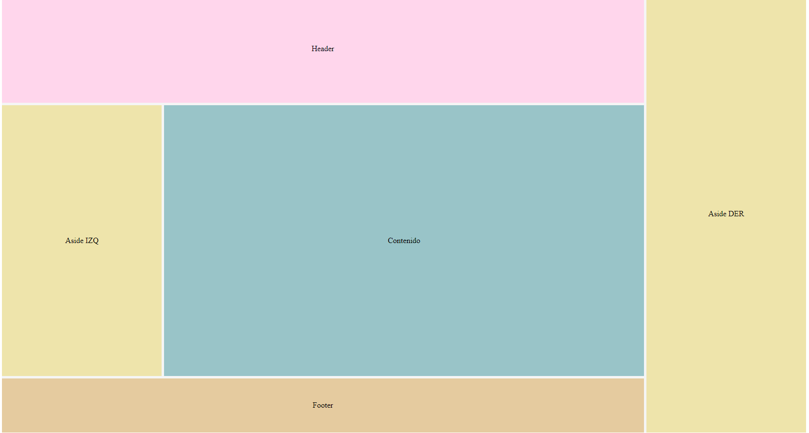

<h1 align="center">Áreas</h1>

<h2>📑 Contenido</h2>

- [Áreas](#áreas)
- [Detalles sobre los nombres de las áreas](#detalles-sobre-los-nombres-de-las-áreas)

## Áreas

Al igual que se pueden asignar nombres a las líneas también podemos asignar áreas. Para asignar nombre a las areas utilizaremos la propiedad `grid-area: nombreArea;` en los items. Y para asignar las posiciones y lo que se expande cada item, lo haremos con `grid-template-areas`. Las columnas van dentro de comillas dobles "" y cada "" es una nueva fila.

```css
Selector {
  grid-template-areas:
    "Columna1 Columna2 Columna3" /* Fila 1*/
    "Columna1 Columna2 Columna3" /* Fila 2*/
    "Columna1 Columna2 Columna3 "; /* Fila 3*/
}

/* Si queremos que el item se expanda*/

Selector {
  grid-template-areas:
    "Item(A) Item(A)  Item(C) " /* Fila 1*/
    "Item(A)  Item(A)  Item(C) " /* Fila 2*/
    "Item(B)  Item(B)  Item(B)  "; /* Fila 3*/
}
```

Ejemplo

```html
<!-- HTML -->
<div class="wrapper">
  <header class="flex">Header</header>
  <aside class="flex">Aside IZQ</aside>
  <article class="flex">Contenido</article>
  <aside class="flex">Aside DER</aside>
  <footer class="flex">Footer</footer>
</div>
```

```css
/* CSS */
.wrapper {
  height: 100vh;
  display: grid;
  gap: 5px;
  grid-template-columns: 1fr 3fr 1fr;
  grid-template-rows: 2fr 5fr 1fr;
  grid-template-areas:
    "header header derecha"
    "izquierda article derecha"
    "footer footer derecha ";
}

header {
  background-color: #ffd6ec;
  grid-area: header;
}
aside:first-of-type {
  background-color: #eee4ab;
  grid-area: izquierda;
}
article {
  background-color: #99c4c8;
  grid-area: article;
}
aside:last-of-type {
  background-color: #eee4ab;
  grid-area: derecha;
}
footer {
  background-color: #e5cb9f;
  grid-area: footer;
}

.flex {
  display: flex;
  justify-content: center;
  align-items: center;
}
```



> [!TIP]
>
> Si necesitas dejar un hueco o espacio vacío se puede agregar un punto.
>
> ```css
> /* CSS */
> grid-template-areas:{
>          "header header ."
>          "izquierda article derecha"
>          ". footer . ";
>      }
> ```

## Detalles sobre los nombres de las áreas

Usa nombres relacionados con el contenido, como `header`, `main`, `footer`, en lugar de genéricos como `A`, `B`. Esto ayuda a mantener el código más legible y comprensible.

> [!NOTE]
>
> `header` y `Header` (`grid-template-areas` distingue entre mayúsculas/minúsculas).
