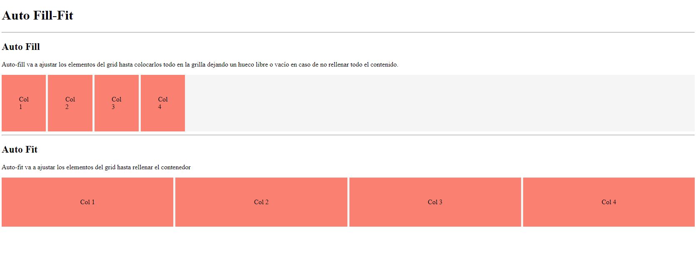

<h1 align="center">Auto fill y auto fit</h1>

<h2>📑 Contenido</h2>

- [Auto fill y auto fit](#auto-fill-y-auto-fit)
  - [Auto fill](#auto-fill)
  - [Auto fit](#auto-fit)
  - [Ejemplo](#ejemplo)

## Auto fill y auto fit

### Auto fill

Auto-fill va a ajustar los elementos del grid hasta colocarlos todo en la grilla dejando un hueco libre o vacío en caso de no rellenar todo el contenido.

### Auto fit

Auto-fit va a ajustar los elementos del grid hasta rellenar el contenedor

### Ejemplo

```html
<!-- HTML -->
<div class="wrapper autofill">
  <div class="flex">Col 1</div>
  <div class="flex">Col 2</div>
  <div class="flex">Col 3</div>
  <div class="flex">Col 4</div>
</div>

<div class="wrapper autofit">
  <div class="flex">Col 1</div>
  <div class="flex">Col 2</div>
  <div class="flex">Col 3</div>
  <div class="flex">Col 4</div>
</div>
```

```css
/* CSS */
.wrapper {
  display: grid;
  gap: 5px;
}

.wrapper div {
  background-color: salmon;
  padding: 50px;
}

.autofill {
  grid-template-columns: repeat(auto-fill, minmax(100px, 1fr));
}

.autofit {
  grid-template-columns: repeat(auto-fit, minmax(100px, 1fr));
}

.flex {
  display: flex;
  justify-content: center;
  align-items: center;
}
```



> [!TIP]
>
> Con `minmax(valorMínimo, valorMáximo)` podemos establecer el mínimo y el máximo que queremos que ocupen las columnas-filas.
