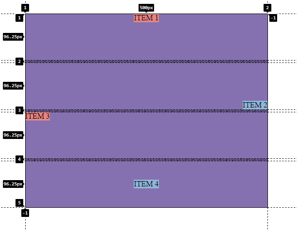

<h1 align="center">Mover items</h1>

<h2>📑 Contenido</h2>

- [Mover items](#mover-items)
- [Buenas prácticas](#buenas-prácticas)

## Mover items

Al igual que vimos en Flexbox, grid también permite mover los items de forma individual. Los elementos se alinean dentro de la celda, `align-self` utiliza el eje en bloque(column) y `justify-self` eje en línea(row). El método abreviado de `align-self` y `justify-self` es `place-self`. Con `place-self` podemos alinear items de manera rápida en una sola línea `place-self: center;`.

Ejemplo

```html
<!-- HTML -->
<div class="wrapper">
  <div class="grid-item">ITEM 1</div>
  <div class="grid-item">ITEM 2</div>
  <div class="grid-item">ITEM 3</div>
  <div class="grid-item">ITEM 4</div>
</div>
```

```css
/* CSS */
.wrapper {
  width: 500px;
  height: 400px;
  background-color: #937dc2;
  display: grid;
  gap: 5px;
}
.grid-item:nth-child(even) {
  background-color: #9fc9f3;
}

.grid-item:nth-child(odd) {
  background-color: #ff9494;
}

.grid-item:nth-child(1) {
  align-self: start;
  justify-self: center;
}

.grid-item:nth-child(2) {
  align-self: end;
  justify-self: end;
}

.grid-item:nth-child(3) {
  align-self: start;
  justify-self: start;
}

.grid-item:nth-child(4) {
  place-self: center;
}
```



## Buenas prácticas

- Usar `place-self` para simplificar el código cuando `align-self` y `justify-self` tienen el mismo valor.

- Combinar con `grid-template-areas` para garantizar una alineación más clara y controlada en el diseño.
