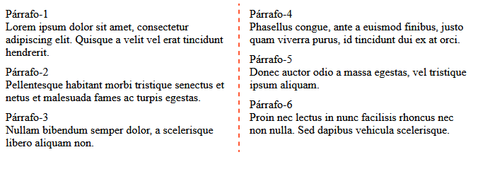

<h1 align="center">Multicolumn layout</h1>

<h2>📑 Contenido</h2>

- [¿Qué es multicolumn layout?](#qué-es-multicolumn-layout)
- [Propiedades](#propiedades)
- [Ejemplo](#ejemplo)

## ¿Qué es multicolumn layout?

El uso de columnas múltiples en CSS se denomina "multicolumn layout" o "diseño de múltiples columnas" en castellano. Esto te permite dividir el contenido de un elemento en varias columnas, lo que es útil para la presentación de texto y otros tipos de contenido.

## Propiedades

- **column-count:** Esta propiedad permite establecer el número de columnas que se deben crear dentro de un elemento. Por ejemplo, puedes definir `column-count: 3;` para dividir el contenido en tres columnas.
- **column-width:** En lugar de especificar el número de columnas, puedes usar esta propiedad para establecer el ancho deseado de cada columna. Por ejemplo, `column-width: 200px;` hará que cada columna tenga un ancho de 200 píxeles.
- **column-gap:** Controla el espacio entre las columnas. Puedes definir un valor en píxeles o cualquier otra unidad de medida para establecer la separación entre las columnas. Por ejemplo, `column-gap: 20px;` establecerá un espacio de 20 píxeles entre las columnas.
- **column-rule-width, column-rule-style, column-rule-color:** Estas propiedades te permiten controlar el ancho, el estilo y el color del borde entre las columnas de manera individual si deseas un mayor control sobre el diseño del borde de las columnas.
- **column-rule(shorthand):** Esta propiedad te permite definir un borde entre las columnas. Puedes establecer un ancho, un estilo y un color para el borde. Por ejemplo, `column-rule: 1px solid #333;` creará un borde sólido de 1 píxel de ancho en un color gris oscuro entre las columnas.
- **column-span:** Esta propiedad permite especificar si un elemento debe extenderse a través de todas las columnas o solo a lo largo de la columna actual. Puedes establecer valores como none, all, o 1 para controlar esto.
- **break-before y break-after:** Estas propiedades te permiten controlar si se debe realizar un salto de página antes o después de un elemento que se encuentra dentro de las columnas.
- **break-inside:** Controla si se permite o no que un elemento se divida en múltiples columnas o páginas.
- **column-fill:** Esta propiedad controla cómo se distribuye el contenido en las columnas. Puedes establecerla en auto para permitir que las columnas se llenen de manera equitativa o balance para equilibrar el contenido de manera más uniforme.

## Ejemplo

```html
<!-- HTML -->
<div class="multicolumn-container">
  <p>
    Párrafo-1 <br />
    Lorem ipsum dolor sit amet, consectetur adipiscing elit. Quisque a velit vel
    erat tincidunt hendrerit.
  </p>
  <p>
    Párrafo-2 <br />
    Pellentesque habitant morbi tristique senectus et netus et malesuada fames
    ac turpis egestas.
  </p>
  <p>
    Párrafo-3 <br />
    Nullam bibendum semper dolor, a scelerisque libero aliquam non.
  </p>
  <p>
    Párrafo-4 <br />
    Phasellus congue, ante a euismod finibus, justo quam viverra purus, id
    tincidunt dui ex at orci.
  </p>
  <p>
    Párrafo-5 <br />
    Donec auctor odio a massa egestas, vel tristique ipsum aliquam.
  </p>
  <p>
    Párrafo-6 <br />
    Proin nec lectus in nunc facilisis rhoncus nec non nulla. Sed dapibus
    vehicula scelerisque.
  </p>
</div>
```

```css
/* CSS */
.multicolumn-container {
  column-count: 2;
  column-width: 200px;
  column-gap: 20px;
  column-rule-width: 2px;
  column-rule-style: dashed;
  column-rule-color: #ff5733;
  column-span: all;
  column-fill: balance;
}

.multicolumn-container p {
  margin: 0;
  padding: 5px;
}
```


