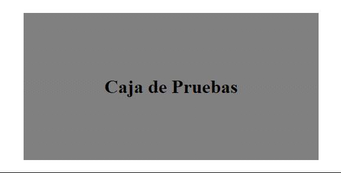

<h1 align="center">Transiciones</h1>

<h2>📑 Contenido</h2>

- [Transiciones](#transiciones)
  - [Propiedades](#propiedades)

## Transiciones

Para entender las animaciones primero tenemos que ver las transiciones. Las transiciones nos permiten crear efectos entre el **estado inicial** y el **estado final**. Son un mecanismo que permite animar cambios de estado de un elemento HTML de manera suave y gradual. Las transiciones se aplican a las propiedades CSS de un elemento y definen cómo debería ocurrir la transformación cuando se cambia el valor de esas propiedades.

### Propiedades

- **transition-property:** Indica las propiedades que se verán afectadas.
- **transition-duration:** Establece el tiempo de duración.
- **transition-delay:** Establece un tiempo de retardo, retardara el inicio de la transición.
- **transition-timing-function:** Ritmo en el que se producen los cambios durante la transición.
  - Valores(Inicio-Transcurso-Final):
    - `ease` lento-rápido-lento
    - `linear` normal
    - `ease-in` lento-normal-normal
    - `ease-out` normal-normal-lento
    - `ease-in-out` lento-normal-lento

> [!NOTE]
>
> Método abreviado de las anteriores propiedades. <br> `transition`: propiedad | duración | tipo-timing-función | retardo;

Ejemplo: Usando la pseudoclase(:hover) crear una transición que modifique tamaño y color.

```html
<!-- HTML -->

<div class="wrapper">
  <h1>Caja de Pruebas</h1>
</div>
```

```css
/* CSS */

.wrapper {
  width: 500px;
  height: 250px;
  margin: 200px auto;
  display: flex;
  justify-content: center;
  align-items: center;
  background-color: grey;

  transition-property: all;
  transition-duration: 1.5s;
  transition-timing-function: linear;
}
.wrapper:hover {
  width: 200px;
  height: 150px;
  font-size: 10px;
  color: palegreen;
  background-color: papayawhip;
}
```



> [!NOTE]
>
> Ejemplo anterior con la propiedad abreviada: `transition: all 1.5s linear;`
