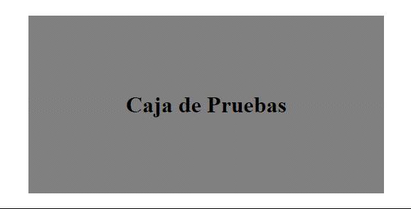

<h1 align="center">Animaciones</h1>

<h2>📑 Contenido</h2>

- [Introducción](#introducción)
- [Animaciones](#animaciones)
  - [Propiedades de animation](#propiedades-de-animation)
  - [Regla Keyframe](#regla-keyframe)

## Introducción

Haciendo uso de animaciones podemos resaltar elementos y mejorar la experiencia del usuario. Por ejemplo crear una animación para que el usuario sepa que se esta cargando, guardando o descargando algo y no crea que se ha quedado colgada la web.

## Animaciones

Con las animaciones podemos añadir más estados a las transiciones. Las animaciones se componen de 2 partes principales, `animation` para indicar el elemento que queremos animar y `@keyframe` para definir el comportamiento.

### Propiedades de animation

- `animation-name`: Establece un nombre a la animación.
- `animation-duration`: Establece el tiempo de duración.
- `animation-iteration-count`: Número de veces que se repetirá la animación.
- `animation-direction`: Dirección de la animación.
- `animation-play-state`: Estado de la animación, para indicar si esta pausado o no
- `animation-fill-mode`: Establece como quedara la animación al acabar.
- `animation-delay`: Establece un tiempo de retardo, retardara el inicio de la transición.
- `animation`: Propiedad abreviada.

### Regla Keyframe

Sintaxis:

```css
@keyframe nombre-de-la-animación {
  selector {
    /*Palabra-Clave o Porcentaje*/
    propiedad: valor;
  }
}
```

> [!NOTE]
>
> Para el selector podemos usar `from` y `to` o un porcentaje del 0% al 100%. Con el selector indicamos en que parte se aplicaran las propiedades de la animación.

Ejemplo: Ampliar tamaño texto usando(from-to)

```html
<!-- HTML -->
<div class="wrapper">
  <h1>Caja de Pruebas</h1>
</div>
```

```css
/* CSS */
.wrapper {
  width: 500px;
  height: 250px;
  margin: 200px auto;
  display: flex;
  justify-content: center;
  align-items: center;
  background-color: grey;

  animation-name: ampliar-tamaño;
  animation-duration: 2s;
  animation-iteration-count: 4;
}

@keyframes ampliar-tamaño {
  from {
    font-size: 10px;
  }

  to {
    font-size: 20px;
  }
}
```



Ejemplo: Ampliar ancho caja usando(porcentajes)

```html
<!-- HTML -->
<div class="wrapper">
  <h1>Caja de Pruebas</h1>
</div>
```

```css
/* CSS */
.wrapper {
  width: 500px;
  height: 250px;
  margin: 200px auto;
  display: flex;
  justify-content: center;
  align-items: center;
  background-color: grey;

  animation-name: mover-caja;
  animation-duration: 5s;
  animation-iteration-count: 4;
}

@keyframes mover-caja {
  0% {
    width: 500px;
  }
  25% {
    width: 600px;
  }
  50% {
    width: 700px;
  }
  75% {
    width: 800px;
  }
  100% {
    width: 900px;
  }
}
```


