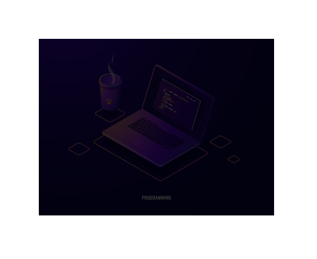
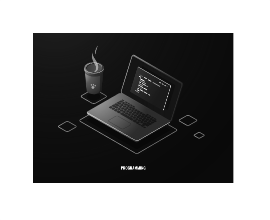
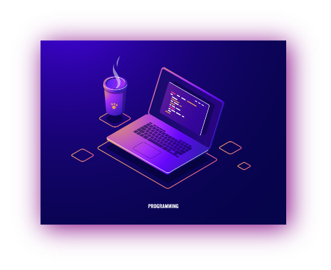
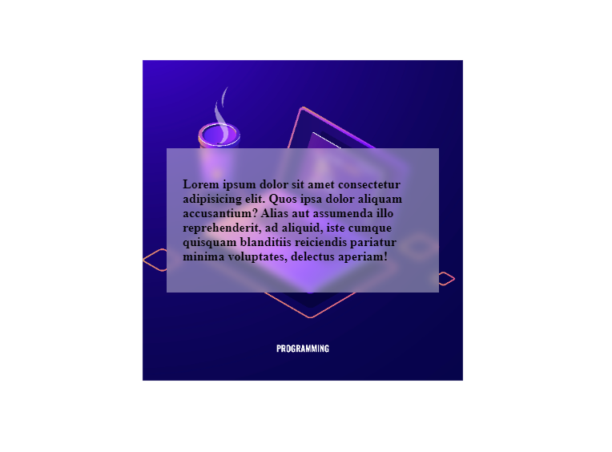

<h1 align="center">Filtros</h1>

<h2>📑 Contenido</h2>

- [Filtros](#filtros)
  - [Blur (desenfoque)](#blur-desenfoque)
  - [Brightness (brillo)](#brightness-brillo)
  - [Grayscale (escala de grises)](#grayscale-escala-de-grises)
  - [Drop-shadow (sombras paralelas)](#drop-shadow-sombras-paralelas)
- [Filtro de fondo](#filtro-de-fondo)

## Filtros

Mediante el uso de filtros podemos añadir efectos a diferentes elementos. Para aplicar estos filtros usaremos la propiedad `filter`.

Ejemplos:

### Blur (desenfoque)

Este filtro recibe un argumento, tiene que ser una unidad de longitud que no sea un porcentaje.

```html
<!-- HTML -->

```

```css
/* CSS */
img {
  width: 400px;
  filter: blur(20px);
}
```


---

### Brightness (brillo)

Este filtro recibe un argumento, tiene que ser un porcentaje. 0% es negro y 100% es el valor inicial.

```html
<!-- HTML -->

```

```css
/* CSS */
img {
  width: 400px;
  filter: brightness(20%);
}
```



---

### Grayscale (escala de grises)

Este filtro recibe un argumento, puede ser un porcentaje o un `1` o `0`.
<br>
1- Aplica escala de grises.<br>
0- Elemento por defecto.

```html
<!-- HTML -->

```

```css
/* CSS */
img {
  width: 400px;
  filter: grayscale(1);
}
```



---

### Drop-shadow (sombras paralelas)

Este filtro recibe un argumento, las areas del elemento y el color.

```html
<!-- HTML -->

```

```css
/* CSS */
img {
  width: 400px;
  filter: drop-shadow(5px 5px 20px purple);
}
```



## Filtro de fondo

Con la propiedad `backdrop-filter` podemos aplicar filtros al fondo del elemento. `backdrop-filter` acepta los mismos valores y utiliza la misma sintaxis que `filter`.

```html
<!-- HTML -->
<div class="fondo">
  <div class="caja">
    <p>
      Lorem ipsum dolor sit amet consectetur adipisicing elit. Quos ipsa dolor
      aliquam accusantium? Alias aut assumenda illo reprehenderit, ad aliquid,
      iste cumque quisquam blanditiis reiciendis pariatur minima voluptates,
      delectus aperiam!
    </p>
  </div>
</div>
```

```css
/* CSS */
.fondo {
  background: url(pruebas.jpg) no-repeat center;
  background-size: cover;
  align-items: center;
  display: flex;
  justify-content: center;
  height: 400px;
  width: 400px;
}

.caja {
  background-color: rgba(255, 255, 255, 0.4);
  backdrop-filter: blur(5px);
  padding: 20px;
  margin: 30px;
  font-weight: bold;
}
```


